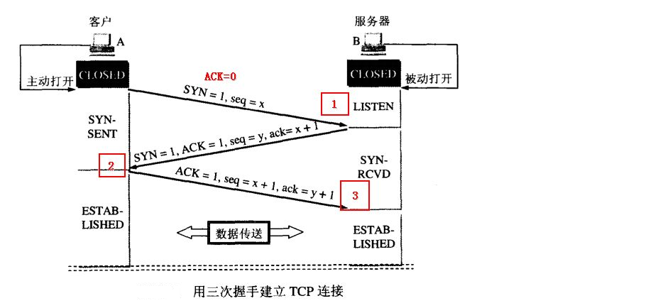
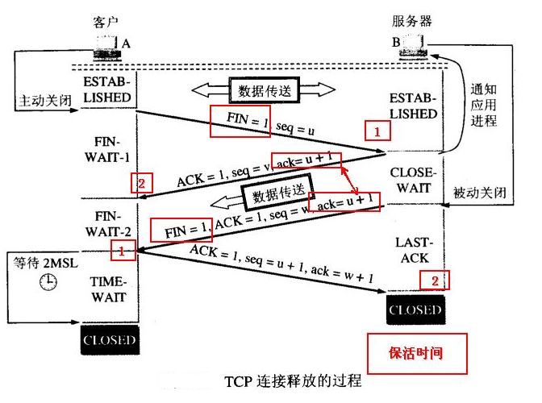
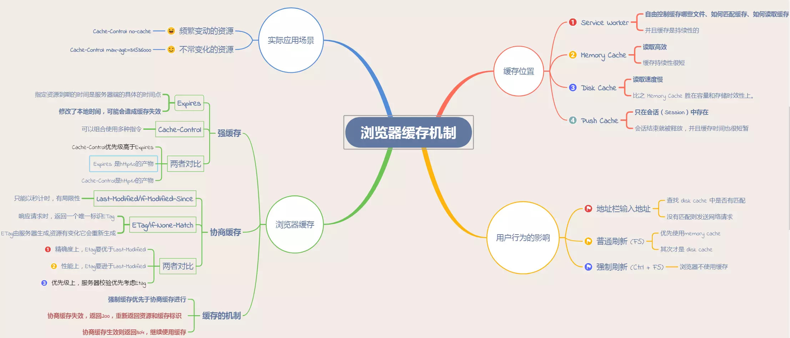
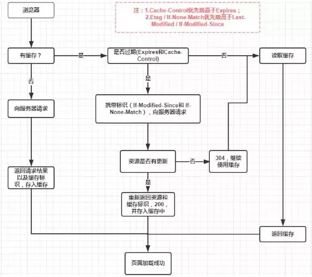

js相关问答
===

### 变量提升的问题
- 函数声名和变量声名，函数提升较高，变量其次，这是js引擎执行过程中的编译阶段，编译阶段会先找到合适的作用域将其关联起来，放在作用域的顶部，示例：  
```javascript
console.log(typeof(foo));   //function
function foo(){}
var foo = 5;
//上面相当于 function foo(){} -- var foo -- console.log() --- foo=5


// 函数的提升高于变量，且不会被变量声名覆盖，但是会被变量赋值覆盖
foo = 5;
console.log(typeof(foo));  //number
function foo(){}
// function foo() {} -- foo=5 -- console.log()
```


### typeof、instanceof、Object.prototype.toString.call()  
* typeof: 对于原始(基本)类型来说，除了null外都可以正确显示类型
    ```javascript
        1 // number
        'a' // string
        undefined // undefined
        true // boolean
        Symbol() // symbol
        null // object
        // 注： NaN 属于number，NaN !== NaN （true)
        // 注：对于函数而言，显示function，[],{}显示object
    ```  
* instanceof: 判断对象的类型，因为内部的机制是通过判断对象的原型链上是否出现过该构造函数 
    ```javascript
        const Person = function() {}
        const p1 = new Person()
        p1 instanceof Person // true

        var str = 'hello world'
        str instanceof String // false

        var str1 = new String('hello world')
        str1 instanceof String // true
        //注： 对于原始类型来说，你想直接通过 instanceof来判断类型是不行的
    ```
* Object.prototype.toString.call()，每一个继承Object的对象都有toString()方法，会返回[Object type]，那么这个type就是对象的类型，但是除了Object类型的对象除外，其他类型直接使用toString方法会直接返回字符串，所以需要使用call或者apply来改变toString方法的执行上下文，这种方法所有基本类型都可以判断，即使是null和undefined
    ```javascript
        Object.prototype.toString.call('An') // "[object String]"
        Object.prototype.toString.call(1) // "[object Number]"
        Object.prototype.toString.call(Symbol(1)) // "[object Symbol]"
        Object.prototype.toString.call(null) // "[object Null]"
        Object.prototype.toString.call(undefined) // "[object Undefined]"
        Object.prototype.toString.call(function(){}) // "[object Function]"
        Object.prototype.toString.call({name: 'An'}) // "[object Object]"
    ```


### 类型转换  
1. 转换为boolean
    > 在条件判断时，除了 undefined，null， false， NaN， ''， 0， -0，其他所有值都转为 true，包括所有对象  
2. 对象转原始类型  
    > 对象转换类型的时候，调用内置的[[ToPrimitive]]函数，逻辑一般如下：  
    - 如果已经是原始类型了，就不需要转换了
    - 调用x.valueOf(), 如果转换为基础类型，就返回转换的值
    - 调用x.toString(), 如果转换为基础类型，就返回转换的值
    - 如果都没有返回原始类型就会报错
    ```javascript
        toPrimitive(input,preferedType?) // input是值，preferedType是转换类型，可以是字符串，也可以是数字
        // 如果转换类型是number 则步骤同上，如果转换类型为string，则2、3交换执行，先toString
        // 也可以省略preferedType，此时，日期会被当作字符串，其他当作number
        [] + [] = ''
        // 按照上述步骤，valueOf返回的依然是对象，所以执行toString返回的''
        // '' + '' = ''
        [] + {} = "[object Object]"
        // []转换后为‘’，{} 转换后为"[object Object]"
        {} + [] = 0
        // 特殊的一点是: 如果{}既可以被认为是代码块，又可以被认为是对象，那么js会把这个当作代码块 即 + [],快速转换数字类型，即0

        1 + [] === '1' // [].toString() === '', 1 + '' === '1'
    ```
3. 四则运算  
    - 运算中其中一方为字符串，那么就会把另一方也转换为字符串
    - 如果一方不是字符串或者数字，那么会将它转换为数字或者字符串
    ```javascript
        1 + '1' // '11'
        true + true // 2
        4 + [1,2,3] // "41,2,3"
        // 另外这个表达式 'a' + + 'b'
        // + 'b' 等于 NaN， + '1'这种形式可以快速转换为数字类型Number('b') = NaN
        // 所有答案是'aNaN'
    ```
    - 除了加法的运算符来说，只要其中一方是数字，另一方就会被转换为数字  
    ```javascript
        4 * '3' // 12
        4 * [] // 0
        4 * [1, 2] // NaN 
    ```
4. 比较运算符
    - 如果是对象，就通过toPrimitive转换为对象
    - 如果是字符串，就通过unicode字符索引来比较
    ```javascript
        let a = {
            valueOf() {
                return 0
            },
            toString() {
                return '1'
            }
        }
        a > -1 // true
    ```

### 什么是原型对象，原型链？ 

* 构造函数
    - 用new关键字来调用的函数成为构造函数，函数名首字母一般大写  
* 原型对象
    - 每一个构造函数在被创建出的时候系统会自动给这个构造函数创建并关联一个对象，这个对象就叫做原型对象，通过prototype来访问  
    - 作用：实现继承  
```javascript
function Child(name, age) {
    this.name = name
    this.age = age
}
var obj = new Child('jeremy', 30);
obj.__proto === Child.prototype // true 都指向原型队形
// 通过new一个构造函数出来的对象有一个__proto__的属性指向构造函数的原型对象
Child.prototype.constructor --> function Child(){} // 原型对象的constructor指向构造函数 
obj.__proto__.constructor === function Child(){} // true
obj.__proto__.__proto__ === Object.prototype // true
Object.prototype.__proto__ // null 顶层

查找属性，如果本身没有，则会去__proto__中查找，也就是构造函数的显式原型中查找，如果构造函数中也没有该属性，因为构造函数也是对象，也有__proto__，那么会去它的显式原型中查找，一直到null
```
>原型链实际上就是上面三者（原型，构造函数，实例）之间的关系，我们通过这层关系层层寻找对象>的属性，这种关系就构成了一种链式感，也可以定义为查找对象属性的关系。  
* 关系图如下：  
  
<br />


## 对象（源自js高级程序设计第三版）
1. 属性：包括数据属性和访问属性
    - 数据属性：包含四个描述
        * [[configurable]]：否可以进行delete操作
        * [[enumerable]]：是否可以进行枚举for in
        * [[writable]]：是否可以进行更改
        * [[value]]：反应属性的值
    > 通过Object.defineProperty(对象，属性，描述对象)操作  
    ```javascript
        var person = {};
        Object.defineProperty(person, 'name', {
            configurable: true,
            enumerable: true,
            writable: false,
            value: 'jeremy'
        })
        person.name = '123'
        console.log(person) // jeremy
        // 注意：configurable一旦设置为false，将不会在被更改回来
    ```
    - 访问属性：包含四个描述
        * [[configurable]]：否可以进行delete操作
        * [[enumerable]]：是否可以进行枚举for in
        * [[Get]]：读取数据时调用的函数，默认返回undefined
        * [[Set]]：设置数据时调用的函数，默认返回undefined
         ```javascript
            var person = {
                _name: 'jeremy'
            };
            Object.defineProperty(person, 'name', {
                get: function (val) {
                    return this._name
                },
                set: function (val) {
                    this._name = val
                }
            })
            person.name = 'old'
            console.log(person.name) // old
            // 如果想要重新get，set方法，可以通过如下
            person.__defindGetter__('name', function() {
                return this._name
            })
            person.__defindSetter__('name', function() {
                this._name = val
            })
        ```
    - 定义多个属性Object.defineProperties
    ```javascript
        Object.defineProperties(person, {
            name: {
                writable: true,
                value: 2004
            },
            value: {
                get: function (val) {
                    return this._name
                },
                set: function (val) {
                    this._name = val
                }
            }
        })
    ```
    - 获取属性的描述符Object.getOwnPropertyDescriptor()，返回一个对象
    ```javascript
        // 对于-数据属性-得到：configurable, enumerable, writable, value
        // 对于-访问器属性-得到：configurable, enumerable, get, set
        var person = {};
        Object.defineProperties(person, {
            name: {
                writable: true,
                value: 2004
            },
            value: {
                get: function (val) {
                    return this._name
                },
                set: function (val) {
                    this._name = val
                }
            }
        })
        var descriptor=Object.getOwnPropertyDescriptor(person, 'name') 
    ```


## 创建对象的几种模式（源自js高级程序设计第三版）
1. 创建方式：工厂模式、构造函数模式、原型模式、构造函数+原型模式、动态原型模式、寄生构造函数模式、稳妥构造函数模式
    - 工厂模式：最简单的函数返回模式
    ```javascript
        function create(name, age, friends) {
            var obj = new Object();
            obj.name = name
            obj.age = age
            obj.friends = friends
            return obj;
        }
        var person = create('jeremy', 18, ['sam']);
        // 解决了创建多个类似对象的问题，但是无法解决对象的类型
    ```
    - 构造函数模式：通过new 构造函数来得到一个实例
    ```javascript
        function Create(name, age) {
            this.name = name
            this.age = age
            this.sayName = function(){}
        }
        var person1 = new Create('jeremy', 18);
        var person2 = new Create('allan', 28);
        // new的过程分为：创建一个对象，改变this指向，执行构造函数的代码，返回一个对象
        // 问题：每个方法（sayName）都要在每个实例上重新创建一次，也就是person1.sayName == person2.sayName false
        // 为了避免这个重复创建的问题就有了原型模式
    ```
    - 原型模式：prototype的好处在于可以让所有的实例共享它所包含的属性和方法
    ```javascript
        //理解：只要创建一个函数，就会按照一组特定的规律，为该函数提供一个prototype的属性，这个属性指向原型对象，默认情况下，所有的原型对象会自动获得一个constructor属性，该属性包含一个指向prototype属性所在函数的指针，即Person.prototype.constructor == Person  
        //当调用构造函数创建一个实例时，该实例包含一个指针[[prototype]]，虽然无法访问，但可以通过__proto__，但要记住这个连接存在于实例和构造函数的原型对象之间

        // 判断的条件isPrototypeOf() 和 Object.getPrototyoeOf()获取原型对象
        Person.prototype.isPrototypeOf(person1) // true
        Object.getPrototyoeOf(person1) // Person.prototype
        Object.getPrototyoeOf(person1).name // jeremy 只能是在原型对象属性name，不是this.name

        // 检测属性存在实例中还是原型中的方法 hasOwnProperty()
        person1.hasOwnProperty('name') // 在实例中返回true，原型返回false
        // 如果要取得原型属性的描述则用 Object.getOwnPropertyDescriptor()

        // in 操作符也可以判断属性的归属问题
        console.log(name in person1) // true 无论该属性在实例还是原型对象上只要有就返回true，因此可以通过in 和 hasOwnProperty()来确定属性到底在实例还是原型对象上


        function Person() {}
        Person.prototype.name = 'jeremy';
        Person.prototype.age = 18;
        Person.prototype.sayName = function () {
            console.log(this.name)
        };
        var person = new Person();
        console.log('name' in person) // true
        person.name = 'allan'
        console.log(person.hasOwnProperty('name')) // true  去掉上面的就是false
        console.log(Object.getPrototypeOf(person).name) // jeremy
        console.log(Object.getOwnPropertyDescriptor(person, 'name')) // {value: 'allan', writable: true, enumerable: true, configurable: true}
        console.log(Object.getOwnPropertyDescriptor(Person.prototype, 'name')) // {value: 'jeremy', writable: true, enumerable: true, configurable: true}


        // 问题：共享属性会带来一定的不变，针对于属性值为对象的
        Person.prototype.friends = ['lili', 'hanmeimei'];
        var other1 = new Person();
        var other2 = new Person();
        other1.friends.push('lilei');
        console.log(other1.friends == other2.friends)
        // 所以就有了下面的模式
    ```
    - 构造函数+原型模式：构造函数定义实例属性，原型模式定义共享属性和方法
    ```javascript
        function Person(){this.friends = ['lili']}
        Person.prototype.countFriends = function() {console.log(this.friends.length)}
        var other1 = new Person();
        var other2 = new Person();
        other1.friends.push('lilei');

        other1.friends.countFriends // 2
        other2.friends.countFriends // 1
    ```


## 继承的几种方式（源自js高级程序设计第三版）
1. 方式：原型链(依据)、借助构造函数、组合继承、原型式继承、寄生式继承、寄生组合式继承、
    - 原型链
    ```javascript
        // 利用原型让一个引用类型继承另一个引用类型的属性和方法 
        // 通过原型链继承主要是通过将原型对象等于另一个实例 Sub.prototype = new Super();
        // 所有的函数的默认的原型都是Object的实例，也就是所有原型链的顶端就是Object.prototype
        function Super() {
            this.property = true
        }
        Super.prototype.getSuperValue = function () {
            return this.property
        }

        function Sub() {
            this.property = false
        }
        Sub.prototype = new Super();

        Sub.prototype.getSupValue = function () {
            return this.property
        }
        var instance = new Sub();
        //确定原型链的关系可以通过instanceOf(判断构造函数是否出现在原型链中)
        console.log(instance instanceOf Object) // true
        console.log(instance instanceOf Sub) // true
        console.log(instance instanceOf Super) // true

        // 问题：同创建对象一样，对于引用类型来说有共用的特性，例如属性之为数组时，其中一个实例进行了操作，另外一个实例的该属性也同样会改变
        // 第二个问题，就是不能向超类型的构造函数传递参数
    ```
    - 借助构造函数：即在子类型构造函数的内部调用超类型构造函数
    ```javascript
        function Super(name) {
            this.colors = ['red','blue']
            this.name = name
        }
        function Sub() {
            Super.call(this, 'jereky')
        }
        var instance = new Sub();
        console.log(instance.colors) // ['red','blue']
        console.log(instance.name) // jereky
        // 相比较原型对象而言，可以像超类型构造函数传递参数
        // 问题：方法都在构造函数中定义的话，那么复用就无从谈起
    ```
    - 组合继承：通过原型链和构造函数组合得到，即通过原型链实现对原型属性和方法的继承，通过构造函数实现对实例属性的继承
    ```javascript
        function Super(name) {
            this.name = name
            this.colors = ['red','blue']
        }
        Super.prototype.sayName = function () {
            console.log(this.name)
        }
        function Sub(name, age) {
            Super.call(this, name)
            this.age = age
        }
        Sub.prototype = new Super();
        Sub.prototype.constructor = Sub;

        Sub.prototype.sayAge = function () {
            console.log(this.age)
        }
        var instance1 = new Sub('jeremy', 12);
        instance1.colors.push('1')
        console.log(instance1.colors.length) // 3 

        var instance2 = new Sub('allan', 18);
        console.log(instance2.colors.length) // 2
    ```

    - 原型式继承
    - 寄生式继承
    - 寄生组合式继承


### 什么是闭包，作用域链？  
>闭包是指有权访问另一个函数作用域中的变量的函数,创建闭包的最常见的方式就是在一个函数内创建另一个函数,通过另一个函数访问这个函数的局部变量。  
> 组成部分包含两部分：1）上下文环境A，2）在A中创建函数B 。我们调用B的时候能够访问到A中的变量，这就形成了闭包  

> 缺点：变量常驻内存，过多使用容易造成内存溢出（解决办法：手动将函数A置为空对象null）  
> 优点：缓存变量，使变量局部化  
> 作用域：就是函数和变量的可访问范围，分为全局作用域、局部作用域、块级作用域  
> 作用域链：其实就是在作用域中向上的访问形成的一种链式结构  

<br />

### 事件循环(event loop)
1. 它是js执行事件的机制，js在执行的过程中产生执行环境，这些执行环境会被顺序的加入到执行栈中，如果遇到异步代码，会被挂起并加入到```Task```队列中，一旦执行战为空，```event loop```就会从```Task```队列```callback queue```中拿出需要执行的代码放入到执行栈中执行  
2. 任务分为宏任务和微任务： 
    > 宏任务： ```script、 setTimeout、 setInterval、 setImmediate、 I/O、 UI rendering```  
    > 微任务： ```process.nextTick、 promise.then、 Object.observe、 MutationObserver、 ```
    > 顺序：同步任务 -> 执行栈为空，查询是否又微任务-> 执行所有的微任务-> 必要下渲染UI-> 开启下一轮的Event loop，执行宏任务中的异步代码
<br />

### 对promise的理解 以及 Promise/A+规范
1. Promise/A+规范
    - 一个promise的状太只能有pending\fulfilled\rejected，并且只能是pending到fulfilled、rejected，并且不可逆
    - promise有then的方法，接受两个参数onFulfulled\onRejected，then方法返回一个promise
> promise是一种异步编程的解决方案，解决了回掉嵌套太多导致代码臃肿，降低可读性。es6提供了这个API，并纳入标准。  
> 简单说promise就是一个容器，里面存储着某个未来才会结束的事件（通常是异步）    
promise本身包含三种状态：pending，fulfilled，rejected，状态只能从pending--->fulfilled, pending--->rejected，不可逆；  
promise有.then的方法，返回也是一个promise对象，可以进行链式调用  
> 缺点：一旦创建无法取消，如果不设置回调，promise内部抛出错误，不会反应到外部，当处于pending状态时，无法得知目前进展到哪个阶段了  
> 手写用例在example中的[promise.js](https://github.com/jeremyChenMing/interview/tree/master/js/example/js)  

<br />

### async/await、 */generator

1. async/await：es7方法，用同步的思维解决异步问题，相比与promise的优势在于处理.then的链式调用，能是代码更加的清晰，缺点是可能会导致性能问题，因为await会阻塞代码。 返回的是一个promise。   

2. */generator函数：es6方法，也是用来解决异步编程的问题，通过*标记这是一个generator函数，内部通过yield来暂停代码，通过.next()来恢复执行，执行.next()返回的是一个对象{value: 值， down: 是否结束}  

3. async相比generator相比多了内部的执行器，其次是await的后面可以跟promise及其他原始类型的数据，yield后面只能跟thunk函数和promise  

# 实现New方法
new 是js中的关键词，它的步骤包括一下：  
    1. 创建一个新对象
    2. 链接到原型上
    3. 绑定this
    4. 返回新对象  
```javascript
function create() {
    // 创建一个空的对象
    let obj = new Object()
    // 获得构造函数
    let Con = [].shift.call(arguments) // con就是function people
    // 链接到原型
    obj.__proto__ = Con.prototype
    // 绑定 this，执行构造函数
    let result = Con.apply(obj, arguments) // result就是People对象
    // 让Con在object里面执行，也就有了name，age属性了，由于函数People没有返回对象，所以直接返回obj
    // 确保 new 出来的是个对象
    return typeof result === 'object' ? result : obj
}

function People(name,age) {
    this.name = name
    this.age = age
}

let peo = create(People,'Bob',22)
console.log(peo.name)
console.log(peo.age)
```


### apply,call,bind的理解
* 三者都是为了改变函数运行时上下文this指向而存在的  
* ```this```总是指向调用某个方法的对象，但是使用call，apply，bind可以改变this的指向问题  
* 区别：
    - 三者接收的第一个参数都是要绑定到this的指向
    - apply的第二个参数是一个数组，call和bind的参数可以时多个
    - bind不会立即调用，其他两个会立即调用
```javascript
Function.prototype.myCall = function (ctx) {
    // console.log(ctx); // 指向data
    // console.log(this); // 指向say函数
    // console.log(arguments); // 参数（第一个是ctx，后面的可以多传一些）
    var ctx = ctx || window;
    ctx.fn = this;
    var arg = [...arguments].slice(1); // 获取后面的参数
    var result = ctx.fn(...arg); // 没有返回值
    delete ctx.fn;
    return result;
}
Function.prototype.myApply = function (context) {
    var context = context || window;
    context.fn = this;
    var result;
    if(arguments[1]) { // 表示apply后面的那个数组参数
        result = context.fn(...arguments[1]);  
    }else{
        result = context.fn()
    }
    delete context.fn;
    return result
}  

```
> 手写用例在example中的[call_apply_bind.js](https://github.com/jeremyChenMing/interview/tree/master/js/example/js)  

<br />

### 环境中this的情况  
1. this指向window，例如：
```javascript
function foo() {console.log(this)}
foo() // window
```
2. 谁调用指向谁
```javascript
var obj = {
    a: 1,
    b: foo
}
obj.foo() // obj
```
3. new来说
```javascript
var c = new foo(); // 永远被指向C，不会被改变
```
4. 箭头函数中的this在定义的时候就被定义了,另外对于箭头函数使用bind是无效的
```javascript
function a() {
    return () => {
        console.log(this)
    }
}
a()() // window
```
5. bind时this指向的是第一个参数，如果第一个参数是空，就指向window，如果bind多次，只取第一次；
```javascript
let a = { name: 'poetries' }
function foo() {
  console.log(this.name)
}
foo.bind(a)() // => 'poetries'
```  

> new方式优先级最高，接下来是bind，下来是obj.foo这种形式，最后就是单独调用这种形式


### 对webpack的理解
1. 它是一个模块加载兼打包的一个工具，他能把各种资源当作模块来加载；  
2. 两大特色是code spliting和tree shaking  
    * 前者：代码分割，按需加载chunks，后者：通过对比把没有用的代码通过插件的方式清除掉  
3. 减少打包时间:
    - 优化loader，例如include、exclude的使用
    - dllplugin
    - 代码压缩（UglifyJS）
4. 减少打包体积:
    - 使用webpack的展示体积包插件,然后分析哪些包过大
    - 按需加载 code spliting
    - tree shaking

### Common JS、AMD、CMD、UMD、ES6的区别
- Commonjs是服务端模块的规范，NodeJS采用了这个规范，规范规定一个单独的文件就是一个模块，加载模块需要使用require方法，返回内部exports对象。
    + 其次CommonJS加载模块是同步了，只有加载完成才能执行后面的操作，但是浏览器环境要从服务器上加载模块，必须采用异步模式，所以就有了AMD CMD  
    + 机制：通过require去引用文件，会将文件执行一遍后，将其结果通过浅克隆的方式，写入全局内存，属于同步加载  
    > exports实际上是一个对module.exports的引用，但注意不能给exports赋值，否则会断开与modules.exports的链接  
    ```javascript
    exports.add = function add () {/* 方法 */}
    // 等同于
    module.exports.add = function add () {/* 方法 */}
    ```
- AMD，使用时需要针对js采用对应的函数库也就是requireJS，主要解决的问题包括：
    + 多个js文件可能有依赖的关系，被依赖的文件需要早于依赖它的文件加载到浏览器中  
    + js加载的时候浏览器会停止页面渲染，加载文件越多，页面失去响应时间越长  
    + 机制：通过require加载时，它会先加载对应的依赖，等依赖资源加载完之后，会执行回调函数，将依赖作为入参，执行对应的业务逻辑。最大的特点也就是依赖前置，属于异步加载
- CMD，同AMD一样，需要seaJS来运行，同AMD的区别是CMD推崇就近依赖，只在用到某个模块的时候在取require，而AMD推崇依赖前置，在定义模块的时候就要声明其依赖的模块  
    + 机制同AMD，区别在于CMD强调延迟加载
- UMD，是AMD和CommonJS的组合，主要解决上面三种加载模块的方法同时有的兼容性问题  
- ES6，使用import和export，import会在js引擎静态分析，在编译时引入代码模块，并非在代码运行时加载
    + 机制：加载时并不会先去与加载整个脚本，而是生成一个只读引用，并且静态解析依赖，等到执行代码时，再去依赖里取出实际需要的模块

### 从url输入到显示页面的步骤
0. 输入完url后先先检查是否有缓存，如果命中缓存，则直接从缓存中读取资源  
1. DNS解析 - 找出真实的ip地址发起服务器请求  
    - 先检查本地hosts文件是否存在域名映射，如果存在，则解析结束，返回ip
    - 如果本地没有则查找本地DNS缓存，如果存在，则解析结束，返回ip
    - 如果本地DNS缓存没有命中，则查找本地的DNS服务器，如果存在，则解析结束，返回ip
    - 如果本地DNS服务器已经缓存了此域名，则解析结束，返回ip
    - 如果以上都解析失败，本地DNS服务器会把请求发送至*根DNS服务器*，根服务器收到请求后会返回一个负责该顶级域名服务器的ip，本地DNS服务器收到ip后，将会请求这个ip对应的服务器，然后这样逐层查找，直到找到域名的主机，返回url对应的ip
2. TCP链接（三次握手 || 四次挥手）
    - 三次握手：（，同步SYN，终止FIN）
        * 客户端主动打开，发送连接请求报文段，将SYN标识位置为1，Sequence Number(序列号)置为x（TCP规定SYN=1时不能携带数据，x为随机产生的一个值），然后进入SYN_SEND状态  
        * 服务器收到SYN报文段进行确认，将SYN标识位置为1，ACK置为1，Sequence Number置为y，Acknowledgment Number(确认序列号)置为x+1，然后进入SYN_RECV状态，这个状态被称为半连接状态  
        * 客户端再进行一次确认，将ACK置为1（此时不用SYN），Sequence Number置为x+1，Acknowledgment Number置为y+1发向服务器，最后客户端与服务器都进入ESTABLISHED状态  
          
        > 为什么需要三次握手？  
        > 首先解释下这些字的意义：  
        > 确认ACK：=1字段有效,=0无效，在连接建立后这个值必须为1  
        > 同步SYN：在建立连接时用来同步序号，
        > 终止FIN：用来释放连接，=1时表示此报文的发方的数据已经发送完毕，并要求释放连接  
        > 所以主要是为了防止已经失效的连接（因为某些网络因素而延迟到达服务器的请求）又回传到了服务器，而造成的资源浪费，如果只有两次，那么上述情况一但回传到了服务器，服务器就建立了连接等待客户端的请求，但是客户端并没有请求，服务器却一直在等待，这样许多服务器的资源就被浪费了
    - 四次挥手  
        * 客户端发送一个报文给服务端（没有数据），其中FIN设置为1，Sequence Number置为u，客户端进入FIN_WAIT_1状态  
        * 服务端收到来自客户端的请求，发送一个ACK给客户端，Acknowledge置为u+1，同时发送Sequence Number为v，服务端年进入CLOSE_WAIT状态  
        * 服务端发送一个FIN给客户端，ACK置为1，Sequence置为w，Acknowledge置为u+1，用来关闭服务端到客户端的数据传送，服务端进入LAST_ACK状态 
        * 客户端收到FIN后，进入TIME_WAIT状态，接着发送一个ACK给服务端，Acknowledge置为w+1，Sequence Number置为u+1，最后客户端和服务端都进入CLOSED状态  
          
        > 为什么是四次挥手？
        > 因为TCP是双工通信，双方都可以主动关闭连接，四次挥手也是为了更好的关闭连接，client发送FIN告诉服务器我已经完成发送了，serve回复ack来确认我直到了，这样就关闭了client--->server的信通道，但是还可以接口server ---> client, 所以server也发送FIN表示我也不在发送数据了，client也发送一个ack确认表示知道了，这样就关闭了server到client的信通道。
3. 浏览器发送http请求接口  
4. 服务端处理（将数据返回给客户端）  
5. 关闭TCP连接    
6. 浏览器解析资源并布局渲染  
    - 渲染的原理：浏览器接收到html后先解析成dom树和cssom树，构建render树，布局render树，绘制render树  
    - 在布局render树的时候涉及到两个概念回流reflow和重绘repaint
    > reflow: 计算dom的位置及大小  
    > repaint: 计算字体、颜色等过程  


> 补充https加密的握手过程
> 1. 客户端发送加密请求
> 2. 服务器收到请求后，确认加密协议版本是否一致，一致则返回服务器证书，否则关闭加密通信
> 3. 客户端收到服务器证书后，验证证书是否有效，如果失效，则会给访问者一个警示，由其决定是否继续链接，如果没有失效，则使用证书中的公匙加密一个随机数（pre-master key）返给服务器，同时返回客户端握手结束通知
> 4. 服务器收到客户端发来的pre-master key后，计算生成本次会话的“会话密匙”，向客户端发送服务器握手结束通知  
> 5. 至此，整个握手结束，接下来客户端和服务器端进入加密通信


### 为什呢操作DOM会慢
因为 DOM是属于渲染引擎中的东西，而 JS 又是 JS 引擎中的东西。当我们通过 JS 操作 DOM 的时候，其实这个操作涉及到了两个线程之间的通信，那么势必会带来一些性能上的损耗。操作 DOM 次数一多，也就等同于一直在进行线程之间的通信，并且操作 DOM 可能还会带来重绘回流的情况，所以也就导致了性能上的问题  
> 问题：一次性插入几万个dom，如何实现页面不卡顿？  
> 思路：如何分批次的插入dom。所以第一种是使用requestAnimationFrame的方式去循环插入DOM。第二种是使用虚拟滚动的方式去渲染，即先搞定可视区域，然后滚动插入元素。

> 用例requestAnimation在example里面的[requestAnimation.js](https://github.com/jeremyChenMing/interview/tree/master/js/example/js)方法一

> 用例可视区域在example里面的[requestAnimation.js](https://github.com/jeremyChenMing/interview/tree/master/js/example/js)方法二


### 网站的性能优化和SEO 
1. 性能优化
    - 减少http的请求，设置合理的缓存  
    > 合并css、合并js、雪碧图，小图片使用base64，使用icon字体代替小图标  
    > 强缓存/协商缓存的应用
    - css放在页面顶部，使用link标签，js放在底部，压缩css和js
    - 禁止使用iframe，因为他会阻塞onload事件，降低cpu的消耗，使用css3代替动画，减少js操作dom
    - 减少引起重绘和回流的操作
        * 使用translate代替top
        * opacity代替visibility
        * 不要使用table布局
    - 使用CDN: 因为CND缓存方便，突破浏览器的并发限制，节约cookie宽带，节约主域名的连接速度，防止不必要的安全问题，Gzip压缩  
    - 使用http/2.0: 因为2.0版本中引入了多路复用，能够让多个请求使用同一个tcp链接，提升网页的加载速度，并且还支持Header压缩，进一步的减少了请求的数据大小
    - 图片使用懒加载技术  
2. SEO
    - 合理的title、description、keywords，搜索对这三项的权重逐渐减小
    - 语义化的html标签，能让搜索引擎容易理解网页
    - 重要的内容不用js输出，因为爬虫不会爬取js上的内容
    - 少用iframe，搜索引擎不会抓去iframe上的内容
    - 非装饰性的图片必须加alt属性
    - 提高网站的显示速度


### 跨域  
1. 因浏览器同源策略的影响，我们需要从别的域名获取数据，此时就需要跨域，同源是指协议、域名、端口号相同，跨域的方式有以下几种：
    * JSONP：利用script标签的src属性，提供一个回调函数来接收数据
    > 兼容性不错，但是只能请求get  
    * document.domain：该方式只能用于主域名相同的情况下，例如```a.text.com``` 和 ```b.text.com```，只需要给页面添加```document.domain = "text.com"```  
    * postMessage：通常用于获取潜入页面中的第三方数据，一个页面发送消息，另一个页面判断来源并接收消息  
    ```javascript
    // 发送消息端
    window.parent.postMessage('message', 'http://test.com')
    // 接收消息端
    var mc = new MessageChannel()
    mc.addEventListener('message', event => {
    var origin = event.origin || event.originalEvent.origin
        if (origin === 'http://test.com') {
            console.log('验证通过')
        }
    })
    ```  
    * **CORS**：跨域资源共享(Cross-origin Resource Sharing)，IE10+，主要是通过一些额外的头部信息来完成资源安全的访问  
        - 简单请求：使用GET、POST、HEAD请求，字段content-type包含三者之一(text/plain、multipart/form-data、application/x-www-form-urlencoded)  
        > 请求端头部携带origin: foo.example等  
        > 服务端头部返回携带: Access-Control-Allow-Origin: * （允许任意外域访问）
        - 非简单请求：字段content-type不是上述的，使用PUT、DELETE、OPTIONS、PATCH等，先进行预检请求，在发送实际请求  
        > client使用option进行预检请求，使用access-control-request-method/headers等，server端使用access-control-allow-methods/headers/origin等


### 存储和Service Worker
1. 存储  

特性 | cookie | localStorage | sessionStorage | indexDB
- | :-: | :-: | :-: | -:
数据生命周期 | 一般由服务器生成 | 除非被清理，否则一直存在 | 页面关闭就清理 | 除非被清理，否则一直存在| 
数据存储大小 | 4K| 5M | 5M | 无限|
与服务端通信 | 每次都会携带在header中| 不参与 | 不参与 | 不参与|  

- cookie：用于记录一些用户相关的状态，因为需要注意其安全性，优点是兼容性好，缺点是会增加网络的流量，其次还有数据量有限。可以使用js来进行操作，一般用于存储用户的登录信息，跟踪用户行为，创建购物车等用途。
 
属性 | 作用 |
- | :-: | :-: | :-: | -:
value | 存储值用的 |
http-only | 不能通过js访问，减少攻击 |
secure | 只能在https的请求中携带 |
same-site | 规定浏览器不能在跨域中携带cookie，减少CRSF攻击 |  

2. service worker: 它是运行在浏览器背后的独立的线程，一般可以用于实现缓存的功能，使用时必须为HTTPS协议来保障安全
    - 工作原理：实现缓存功能一般分为三个步骤：首先需要先注册 Service Worker，然后监听到 install 事件以后就可以缓存需要的文件，那么在下次用户访问的时候就可以通过拦截请求的方式查询是否存在缓存，存在缓存的话就可以直接读取缓存文件，否则就去请求数据。
    > 特点：我们可以自己控制缓存哪些文件、如何匹配缓存、如何读取缓存，并且缓存是持续性的。


3. 上述的知识点主要用于性能的方面的考虑，缓存可以减少网络请求所带来的消耗，也是一个网站优化的必要手段，我们从两个位置来解析下缓存:
    - 缓存的位置依次为： Server Worker、 Memory Cache、 Disk Cache、 PushCache，如果都没有就会进行网络请求。Memory是内存中的缓存，读取快，但是周期短，会随着进程的释放而释放。Disk是存储在硬盘上的，读取慢，但是什么都能存。PUSH是http/2中的内容，当以上三种都没有被启用的时候，他才会被使用，缓存时间短暂，只在会话session存在，一旦会话结束就被释放。
    - 缓存的策略： 强缓存和协商缓存
    > 强缓存： http通过Expires和Cache-control来实现的，但是expires受本地时间的限制，可能会出现差错，所以才有了Cache-control，优先与expires，  
    > 协商缓存：http通过```Last-Modified/If-Modified-Since``` 和 ```Etag/If-None-Match```  
        - 前者是根据时间来判断资源是否需要更新，但是也会限于时间的因素才会有Etag的出现  
        - 后者Etag是资源的唯一标识符，一旦资源被修改值就改变  


  
> 强制缓存优先协商缓存，若Expires/Cache-control生效则直接使用缓存，若不生效则进行协商缓存Last-Modified/If-Modified-Since和Etag/If-None


### websocket
由于http存在的弊端（消息只能由客户端推送到服务器端，而服务器端不能主动推送到客户端），导致如果服务器如果由连续的变化，这时只能使用轮询，而轮询效率过低，于是就有了websocket。  
特点：支持双向通信，无跨域问题  
> websocket是基于http协议

### web worker
运行与后台的js代码，不会影响页面的性能
```javascript
<!DOCTYPE html>
<html>
<head> 
<meta charset="utf-8"> 
<title>菜鸟教程(runoob.com)</title> 
</head>
<body>
 
<p>计数： <output id="result"></output></p>
<button onclick="startWorker()">开始工作</button> 
<button onclick="stopWorker()">停止工作</button>
 
<p><strong>注意：</strong> Internet Explorer 9 及更早 IE 版本浏览器不支持 Web Workers.</p>
 
<script>
var w;
 
function startWorker() {
    if(typeof(Worker) !== "undefined") {
        if(typeof(w) == "undefined") {
            w = new Worker("demo_workers.js");
        }
        w.onmessage = function(event) {
            document.getElementById("result").innerHTML = event.data;
        };
    } else {
        document.getElementById("result").innerHTML = "抱歉，你的浏览器不支持 Web Workers...";
    }
}
 
function stopWorker() { 
    w.terminate();
    w = undefined;
}
</script>
 
</body>
</html>

// demo_workers.js
var i=0;

function timedCount()
{
    i=i+1;
    postMessage(i); // 向页面回传一些内容
    setTimeout("timedCount()",500);
}

timedCount();
```


### 节流函数和防抖函数的实现
1. 防抖函数：将对此执行的函数只执行最后一次，简单实现如下:
```javascript
// func是用户传入需要防抖的函数
// wait是等待时间
const debounce = (func, wait = 50) => {
  // 缓存一个定时器id
  let timer = 0
  // 这里返回的函数是每次用户实际调用的防抖函数
  // 如果已经设定过定时器了就清空上一次的定时器
  // 开始一个新的定时器，延迟执行用户传入的方法
  return function(...args) {
    if (timer) clearTimeout(timer)
    timer = setTimeout(() => {
      func.apply(this, args)
    }, wait)
  }
}
```
> 应用：例如keyup事件请求接口查验收入是否符合要求；频繁的点击事件，防止多次请求；  

2. 节流：将多次执行的函数编程每隔一段时间执行一次
```javascript
// func是用户传入需要防抖的函数
// wait是等待时间
const throttle = (func, wait = 50) => {
    // 上一次执行该函数的时间
    let lastTime = 0
    return function (...args) {
        // 当前时间
        let now = +new Date()
        // 将当前时间和上一次执行函数时间对比
        // 如果差值大于设置的等待时间就执行函数
        if (now - lastTime > wait) {
            lastTime = now
            func.apply(this, args)
        }
    }
}
```
> 应用：例如window.onresize事件触发的函数；监听onscroll事件触发的函数；   

> 测试用例在example中的[debounce_throttle.js](https://github.com/jeremyChenMing/interview/tree/master/js/example/js)

### 柯里化函数的实现
定义：把接受多个参数的函数换成接受一个单一参数的函数，并返回接受余下参数而返回结果的新函数的技术  
```javascript
function curry(fn, currArgs) {
    return function () {
        console.log("arguments:", arguments, arguments.length)
        var args = [].slice.call(arguments);
        console.log("args:", args)
        console.log('currArgs', currArgs)
        // 首次调用时未提供最后一个参数
        if (currArgs !== undefined) {
            args = args.concat(currArgs);
        }
        // 递归出口
        if (args.length == fn.length) {
            console.log(1, '0', this)
            return fn.apply(this, args);
        } else {
            return curry(fn, args);
        }
    }
}

function sumOf(a, b, c, d) {
    return a + b + c + d;
}

// 改造普通函数，返回柯里函数
var sum = curry(sumOf);
console.log(sum(1,2,3,4))
// 需要知道函数的参数的个数，个数不够的调用curry，直到满足参数个数需求fn.length，执行fn
// 
```  

### XSS和CSRF和点击劫持和密码安全
1. **XSS**: 跨站脚本攻击，攻击者网web页面插入恶意的html代码  
    * 防范：对用户输入的地方进行过滤，尤其是对```'<','>',',',';'```等,其次就是任何内容写到页面前都加以encode，也就是我们常说的转译输入输出的内容  
2. **CSRF**: 跨站请求伪造，利用用户的登录状态发起恶意的请求  
    * 防范：请求时附带验证信息，阻止第三方网站请求接口  
3. **点击劫持**: 是一种视觉欺骗的攻击手段。攻击者将需要攻击的网站通过 iframe 嵌套的方式嵌入自己的网页中，并将 iframe 设置为透明，在页面中透出一个按钮诱导用户点击  
    * 防范：在http头部中加入```X-FRAME-OPTIONS```,可选三个值DENY、SAMEORIGIN、ALLOW_FROM，其次就是通过js防御，代码如下
    ```javascript
    <head>
        <style id="click-jack">
            html {
            display: none !important;
            }
        </style>
    </head>
    <body>
        <script>
            if (self == top) {
            var style = document.getElementById('click-jack')
            document.body.removeChild(style)
            } else {
            top.location = self.location
            }
        </script>
    </body>
    // 以上代码的作用就是当通过 iframe 的方式加载页面时，攻击者的网页直接不显示所有内容了
    ```  
4. 密码安全
    * 加盐：给原密码添加字符串以增加原密码的长度，增加暴力破解成本，其次还要限制密码错误的次数
    * 前端加密：虽然前端加密对于安全防护来说意义不大，但是在遇到中间人攻击的情况下，可以避免明文密码被第三方获取  


### 垃圾回收机制  
1. **标记清楚**
    - 是当变量进入环境时，将这个变量标记为“进入环境”。当变量离开环境时，则将其标记为“离开环境”。标记“离开环境”的就回收内存 
2. **引用计数**
    - 跟踪并记录每个值被引用的次数，次数为0就被回收  
3. 引起内存泄漏
    - 意外的全局变量
    - 闭包过多的使用
    - 被遗忘的定时器
    - 事件绑定未解除  
> 基本类型被存储在内存中（栈内存），引用对象被存储在内存中（堆内存）  
> 堆和栈的数据结构不同，栈是一种```先进后出```的数据结构，堆是一种```树状```的结构  


### attribute 和 property
1. attribute是HTML标签上的属性，例如id,class,value等，它的值是字符串，共有三个方法: setAttribute、getAttribute、removeAttribute，所有本质上这个方法添加的属性跟写标签上的属性是一样的
2. property是js获取DOM对象上的属性，也就是一个普通的js对象，除了属性值外，还是一些事件值，如click等，property包含attribute  


### 设计模式----工厂模式  
- 将```new```操作单独封装 
- 原则：构造函数和创建者分离，符合开放封闭原则
```javascript
class Product {
    constructor(name) {
        this.name = name;
    }
    init() {
        console.log('init')
    }
    fn1() {
        console.log('fn1')
    }
    fn2() {
        console.log('fn2')
    }
}

class Creator {
    create(name) {
        return new Product(name)
    }
}

let create = new Creator();
let p = create.create('p')
p.init() // init
p.fn1() // fn1
p.fn2() // fn2

```
### 设计模式----单例模式
- 系统中被唯一使用的，一个类中只能有一个实例
- 符合单一的职责原则，只实例化一个对象
```javascript
class LoginForm {
    constructor() {
        this.state = 'hide'
    }
    show() {
        if (this.state === 'show') {
            alert('已经显示了');
            return
        }
        this.state = 'show'
        console.log('登录框显示成功')
    }
    hide() {
        if (this.state === 'hide') {
            alert('已经隐藏')
            return
        }
        this.state = 'hide'
        console.log('登录框隐藏成功')
    }
}
LoginForm.getInstance = (function() {
    let instance
    return function() {
        if (!instance) {
            instance = new LoginForm()
        }
        return instance
    }
})()

let login1 = LoginForm.getInstance()
login1.show()

let login2 = LoginForm.getInstance()
//lgoin2.show() //登录框已经显示 会执行alert
login2.hide()
console.log(login1 === login2) // true
```  


### 设计模式----装饰器模式
- 将现有对象和装饰器进行分离，两者独立存在
- 向对象添加新的功能，并且不改变对象的结构模式
```javascript
// 装饰器的原理
@decorator
class A {}

//等同于
class A{}
A = decorator(A)||A;

// 实例
function testDec(isDec){
    return function(target){
        target.isDec = isDec;
    }
}

@testDec(true)

class Demo{
    //....
}
alert(Demo.isDec) //true


// 常用的connect
@connect()
class Demo extends Component{
    // .....
}

// 相当于
Demo = connect()(Demo) // 这样就和原始写法一样了

``` 
### 设计模式----代理模式
- 使用者无权访问目标对象
- 中间加代理，通过代理做授权和控制
```javascript
//明星
let star = {
    name: "zhangxx",
    age: 25,
    phone: '13910733521',
}

//经纪人
let agent = new Proxy(star, {
    get: function(target, key) {
        if (key === 'phone') {
            //返回经纪人自己的手机号
            return '13838383838'
        }
        if (key === "price") {
            //明星不报价，经纪人报价
            return 120000
        }
        return target[key]
    },
    set: function(target, key, val) {
        if (key === 'customPrice') {
            if (val < 100000) {
                throw new Error("价格太低")
            } else {
                target[key] = val
                return true
            }
        }
    }
})

console.log(agent.name) // zhangxx
console.log(agent.phone) // 13838383838
console.log(agent.age) // 25
console.log(agent.price) // 120000

agent.customPrice = 150000;
console.log('agent.customPrice', agent.customPrice) // 150000
// 明星经纪人就是其中的代理，隔离的使用者和明星

```
### 设计模式----观察者模式（前端设计最重要的一种模式）
- 发布 & 订阅
- 一对多（N）
- 主题和观察者分离，不是主动触发而是被动监听，两者解耦
- Observer和Subject
```javascript
//保存状态，状态变化之后触发所有观察者
class Subject {
    constructor() {
        this.state = 0
        this.observers = []
    }
    getState() {
        return this.state
    }
    setState(state) {
        this.state = state
        this.notifyAllObervers()
    }
    notifyAllObervers() {
        this.observers.forEach(observer => {
            observer.update()
        })
    }
    attach(observer) {
        this.observers.push(observer)
    }
}

//观察者
class Observer {
    constructor(name, subject) {
        this.name = name
        this.subject = subject
        this.subject.attach(this)
        // 这个this指向Observer {name: 'o1', subject: subject对象[state, observers]}
    }
    update() {
        console.log(`${this.name} update,state:${this.subject.getState()}`)
    }
}

let subject = new Subject();
let obs1 = new Observer('o1', subject);
let obs2 = new Observer('o2', subject);
let obs3 = new Observer('o3', subject);
// 每new一次，都会将这个subject实例push到observers数组里面， new过程3次，observers.length = 3

subject.setState(1)
subject.setState(2)
// 当调用setState的时候，数据遍历三次，打印三次
// 第二次调用继续打印三次，只是state的值不一样

```
### import、require、export、module.exports
1. require是Commonjs的部分，是运行时调用的， 从本质上看：require是赋值的过程
2. import是ES6的新规范，编译时调用，所以要放在页面的开头处， 从本质上看：import是解构的过程，但是需要将ES6转换为ES5才能在浏览器中正常的执行
```javascript
// 写法上 require/exports
var a = require('a')
exports.a = a;
module.exports = a;

// import/export
import a from 'a'
export default a;
export const a = 1;
```  


### 常见算法
1. 去重
    - es6 ```Array.from(new Set([...arr]))``` 或者 ```[...new set(arr)]```,
    - 循环+json发
    ```javascript
        function deal(arr = []) {
            let obj = {};
            for(let n=0; n < arr.length; n++) {
                obj[arr[n]] = true
            }
            return Object.keys(obj)
        }
    ```
    - 双for循环
    ```javascript
        function deal(arr = []) {
            for(let n=0; n < arr.length; n++) {
                for(let m=n + 1; m<arr.length; m++) {
                    if(arr[n] === arr[m]) {
                        arr.splice(m,1);
                        m--;
                    }
                }
            }
            return arr
        }
    ```
    - 包含去除法
    ```javascript
        function deal(arr = []) {
            if (!Array.isArray(arr)) {
                console.log('type error!')
                return
            }
            let temp = [];
            for(let n=0; n < arr.length; n++) {
                if(temp.indexOf(arr[n]) === -1) { // !temp.includes(arr[n])
                    temp.push(arr[n])
                }
            }
            return temp
        }
    ```
    - reduce方法
    ```javascript
        function deal(arr = []) {
            if (!Array.isArray(arr)) {
                console.log('type error!')
                return
            }
            temp = arr.reduce( (accumulator, currentValue, currentIndex, array) => {
                console.log(accumulator)
                return accumulator.includes(currentValue) ? accumulator : accumulator.concat(currentValue)
            }, [])
            return temp
        }
    ```  
### http和https
1. http超文本传输协议，https只是多了一个s，即SSL加密，其主要作用加密在传输层协议上，使请求更加的安全。
    - 区别在于：后者需要ca证书，费用较高，使用的端口号也不同，http：80，https：443
    - https的缺点：握手阶段比较费时，缓存不如http高效，SSL证书也需要钱  
2. http 2.0
    - 基于http1.0后的更新，优点是提升网络速度，允许多路复用，多路复用允许同时通过单一的HTTP/2连接发送多重请求-响应信息。改善了：在http1.1中，浏览器客户端在同一时间，针对同一域名下的请求有一定数量限制（连接数量），超过限制会被阻塞。其次是首部压缩
    - http1.1中多了一个字段connection: keep-alive字段，允许一个连接中，可以发送多个request和接受多个response

### http2的多路复用优点
1. http2采用的是**二进制传输格式**，取代了http1的**文本格式**，二进制格式解析更高效，多路复用代替了http1的序列和阻塞机制，所有相同域名请求都通过同一个TCP链接并发完成，而在http1中并发多个请求需要多个TCP链接，而```keep-alive```的开启，也只是解决了多次链接的问题，但依然有效率的问题，还是需要遵循一问一答的形式，也就是必须等上一个请求接受才能发起下一个请求，所以会受到前面的阻塞，在http2这个一问一答的形式就不存在了，首先http2中两个重要的概念就是帧frame和流stream，帧代表最小的数据单位，多个帧组成流，所以```多路复用```解决了http1中的阻塞问题，具体来说就是http2的传输是基于二进制帧的。每一个TCP连接中承载了多个双向流通的流，每一个流都有一个独一无二的标识和优先级，而流就是由二进制帧组成的。二进制帧的头部信息会标识自己属于哪一个流，所以这些帧是可以交错传输，然后在接收端通过帧头的信息组装成完整的数据。这样就解决了线头阻塞的问题，同时也提高了网络速度的利用率。
2. http 常用code码
```javascript
const codeMessage = {
  200: '服务器成功返回请求的数据。',
  201: '新建或修改数据成功。',
  202: '一个请求已经进入后台排队（异步任务）。',
  204: '删除数据成功。',
  301: '永久重定向',
  302: '临时重定向',
  304: '定向取缓存',
  400: '发出的请求有错误，服务器没有进行新建或修改数据的操作。',
  401: '用户没有权限（令牌、用户名、密码错误）。',
  403: '用户得到授权，但是访问是被禁止的。',
  404: '发出的请求针对的是不存在的记录，服务器没有进行操作。',
  406: '请求的格式不可得。',
  410: '请求的资源被永久删除，且不会再得到的。',
  422: '当创建一个对象时，发生一个验证错误。',
  500: '服务器发生错误，请检查服务器。',
  502: '网关错误。',
  503: '服务不可用，服务器暂时过载或维护。',
  504: '网关超时。',
};
```

### 简述npm install的过程  
1. 发出install指令
2. 查询node_modules目录之中是否存在指定模块
    - 存在，不在重新安装
    - 不存在
        - npm向registry查询模块压缩包的网址
        - 下载压缩包，存放在根目录下的.npm目录里
        - 解压压缩包到当前的node_modules目录里  


### 面向对象以及 面向对象编程思维和函数式编程思维
1. 它是一种编程思维，特点是封装、继承、抽象；将所需要的功能抽象为一个对象，然后调用这个对象来完成功能；
    - 封装：将功能重复使用的进行封装到对象中
    - 继承：一般来讲是子继承父类，通过原型继承或者extents继承
    - 多态：实现方法的个性化，不同子类根据状况可以实现不同的方法

2. 创建对象的方法
    - 工厂模式 普通函数的+内部返回
    - 构造函数模式 new Father(); 缺点是：每new一次，都会对内部的方法新建一个副本，浪费开销
    - 原型模式 定义在原型prototype上的方法，然后new Person()构造函数，缺点是：内部属性如果指向的是引用类型，存在共用的特点
    - 组合模式（原型+构造函数），共用属性和方法写在原型上，私有写在构造函数里

3. 面向对象编程思维：它将各种复杂的关系抽象为一个个对象，然后由对象之间的分工合作，完成对真实世界的模拟，关注的是如何把相关的功能，包括函数和数据有组织的绑定到对象身上，它强调封装、继承、多态，把数据和方法封装成对象，使所有的模块达到更好的内聚性和更低的耦合性，使不同的对象之间减少依赖，从而达到代码的可复用性，提高编程效率。

4. 函数式编程思维：它将计算机运算视为函数运算，并且避免使用程序状态以及易变对象。误点：它并不是编程语言中的函数，它指的是数学意义上的函数，即映射关系（如：Y=f(X),就是y和x的对应关系），其实也就是接收一个或多个参数，返回一个或者多个参数，并且没有副作用，类似于纯函数。
    - 特点：1）函数是一等公民（即他可以像其他数据类型一样，可以push到数组里，作为函数参数，或者赋值给变量等），2）纯函数


### 深拷贝和浅拷贝方法
1. 浅拷贝
    - Object.assign()
    - 解构赋值...

2. 深拷贝
    - JSON.parse(JSON.stringigy(object)),原理：用JSON.stringify将对象转成JSON字符串，再用JSON.parse()把字符串解析成对象，一去一来，新的对象产生了，而且对象会开辟新的栈，实现深拷贝，缺点是不能处理函数和null
    - 插件方法lodash中的cloneDeep
    - 递归的方式实现深拷贝
    ```javascript
    //使用递归的方式实现数组、对象的深拷贝
    function deepClone(obj) {
        //判断拷贝的要进行深拷贝的是数组还是对象，是数组的话进行数组拷贝，对象的话进行对象拷贝
        var objClone = Array.isArray(obj) ? [] : {};
        //进行深拷贝的不能为空，并且是对象或者是
        if (obj && typeof obj === "object") {
            for (key in obj) {
                if (obj.hasOwnProperty(key)) {
                    if (obj[key] && typeof obj[key] === "object") {
                        objClone[key] = deepClone(obj[key]);
                    } else {
                        objClone[key] = obj[key];
                    }
                }
            }
        }
        return objClone;
    }
    ```