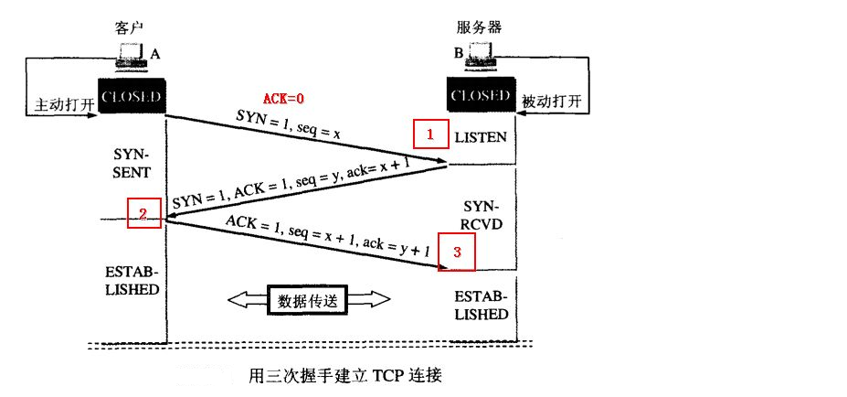

js相关问答
===
### typeof、instanceof  
* typeof: 对于原始(基本)类型来说，除了null外都可以正确显示类型
    ```javascript
        1 // number
        'a' // string
        undefined // undefined
        true // boolean
        Symbol() // symbol
        null // object
        // 注： NaN 属于number，NaN !== NaN （true)
        // 注：对于函数而言，显示function，[],{}显示object
    ```  
* instanceof: 判断对象的类型，因为内部的机制是通过判断对象的原型链中是不是能找到类型的prototype  
    ```javascript
        const Person = function() {}
        const p1 = new Person()
        p1 instanceof Person // true

        var str = 'hello world'
        str instanceof String // false

        var str1 = new String('hello world')
        str1 instanceof String // true
        //注： 对于原始类型来说，你想直接通过 instanceof来判断类型是不行的
    ```

### 类型转换  
1. 转换为boolean
    > 在条件判断时，除了 undefined，null， false， NaN， ''， 0， -0，其他所有值都转为 true，包括所有对象  
2. 对象转原始类型  
    > 对象转换类型的时候，调用内置的[[ToPrimitive]]函数，逻辑一般如下：  
    - 如果已经是原始类型了，就不需要转换了
    - 调用x.valueOf(), 如果转换为基础类型，就返回转换的值
    - 调用x.toString(), 如果转换为基础类型，就返回转换的值
    - 如果都没有返回原始类型就会报错
    ```javascript
        toPrimitive(input,preferedType?) // input是值，preferedType是转换类型，可以是字符串，也可以是数字
        // 如果转换类型是number 则步骤同上，如果转换类型为string，则2、3交换执行，先toString
        // 也可以省略preferedType，此时，日期会被当作字符串，其他当作number
        [] + [] = ''
        // 按照上述步骤，valueOf返回的依然是对象，所以执行toString返回的''
        // '' + '' = ''
        [] + {} = "[object Object]"
        // []转换后为‘’，{} 转换后为"[object Object]"
        {} + [] = 0
        // 特殊的一点是: 如果{}既可以被认为是代码块，又可以被认为是对象，那么js会把这个当作代码块 即 + [],快速转换数字类型，即0

        1 + [] === '1' // [].toString() === '', 1 + '' === '1'
    ```
3. 四则运算  
    - 运算中其中一方为字符串，那么就会把另一方也转换为字符串
    - 如果一方不是字符串或者数字，那么会将它转换为数字或者字符串
    ```javascript
        1 + '1' // '11'
        true + true // 2
        4 + [1,2,3] // "41,2,3"
        // 另外这个表达式 'a' + + 'b'
        // + 'b' 等于 NaN， + '1'这种形式可以快速转换为数字类型Number('b') = NaN
        // 所有答案是'aNaN'
    ```
    - 除了加法的运算符来说，只要其中一方是数字，另一方就会被转换为数字  
    ```javascript
        4 * '3' // 12
        4 * [] // 0
        4 * [1, 2] // NaN 
    ```
4. 比较运算符
    - 如果是对象，就通过toPrimitive转换为对象
    - 如果是字符串，就通过unicode字符索引来比较
    ```javascript
        let a = {
            valueOf() {
                return 0
            },
            toString() {
                return '1'
            }
        }
        a > -1 // true
    ```

### 什么是原型对象，原型链？ 

* 构造函数
    - 用new关键字来调用的函数成为构造函数，函数名首字母一般大写  
* 原型对象
    - 每一个构造函数在被创建出的时候系统会自动给这个构造函数创建并关联一个对象，这个对象就叫做原型对象，通过prototype来访问  
    - 作用：实现继承  
```javascript
function Child(name, age) {
    this.name = name
    this.age = age
}
var obj = new Child('jeremy', 30);
obj.__proto === Child.prototype // true 都指向原型队形
// 通过new一个构造函数出来的对象有一个__proto__的属性指向构造函数的原型对象
Child.prototype.constructor --> function Child(){} // 原型对象的constructor指向构造函数 
obj.__proto__.constructor === function Child(){} // true
obj.__proto__.__proto__ === Object.prototype // true
Object.prototype.__proto__ // null 顶层

查找属性，如果本身没有，则会去__proto__中查找，也就是构造函数的显式原型中查找，如果构造函数中也没有该属性，因为构造函数也是对象，也有__proto__，那么会去它的显式原型中查找，一直到null
```
>原型链实际上就是上面三者（原型，构造函数，实例）之间的关系，我们通过这层关系层层寻找对象>的属性，这种关系就构成了一种链式感，也可以定义为查找对象属性的关系。  
* 关系图如下：  
  
<br />

### 什么是闭包，作用域链？  
>闭包是指有权访问另一个函数作用域中的变量的函数,创建闭包的最常见的方式就是在一个函数内创建另一个函数,通过另一个函数访问这个函数的局部变量。  
> 组成部分包含两部分：1）上下文环境A，2）在A中创建函数B 。我们调用B的时候能够访问到A中的变量，这就形成了闭包  

> 缺点：变量常驻内存，过多使用容易造成内存溢出（解决办法：手动将函数A置为空对象null）  
> 优点：缓存变量，使变量局部化  
> 作用域：就是函数和变量的可访问范围，分为全局作用域、局部作用域、块级作用域  
> 作用域链：其实就是在作用域中向上的访问形成的一种链式结构  

<br />

### 事件循环(event loop)
1. 它是js执行事件的机制，js在执行的过程中产生执行环境，这些执行环境会被顺序的加入到执行栈中，如果遇到异步代码，会被挂起并加入到```Task```队列中，一旦执行战为空，```event loop```就会从```Task```队列```callback queue```中拿出需要执行的代码放入到执行栈中执行  
2. 任务分为宏任务和微任务： 
    > 宏任务： ```script、 setTimeout、 setInterval、 setImmediate、 I/O、 UI rendering```  
    > 微任务： ```process.nextTick、 promise.then、 Object.observe、 MutationObserver、 ```
    > 顺序：同步任务 -> 执行栈为空，查询是否又微任务-> 执行所有的微任务-> 必要下渲染UI-> 开启下一轮的Event loop，执行宏任务中的异步代码
<br />

### 对promise的理解

> promise是一种异步编程的解决方案，解决了回掉嵌套太多导致代码臃肿，降低可读性。es6提供了这个API，并纳入标准。  
> 简单说promise就是一个容器，里面存储着某个未来才会结束的事件（通常是异步）    
promise本身包含三种状态：pending，fulfilled，rejected，状态只能从pending--->fulfilled, pending--->rejected，不可逆；  
promise有.then的方法，返回也是一个promise对象，可以进行链式调用  
> 缺点：一旦创建无法取消，如果不设置回调，promise内部抛出错误，不会反应到外部，当处于pending状态时，无法得知目前进展到哪个阶段了  
> 手写用例在example中的promise.js  

<br />

### async/await、 */generator

1. async/await：es7方法，用同步的思维解决异步问题，相比与promise的优势在于处理.then的链式调用，能是代码更加的清晰，缺点是可能会导致性能问题，因为await会阻塞代码。 返回的是一个promise。   

2. */generator函数：es6方法，也是用来解决异步编程的问题，通过*标记这是一个generator函数，内部通过yield来暂停代码，通过.next()来恢复执行，执行.next()返回的是一个对象{value: 值， down: 是否结束}  

3. async相比generator相比多了内部的执行器，其次是await的后面可以跟promise及其他原始类型的数据，yield后面只能跟thunk函数和promise  

# 实现New方法
new 是js中的关键词，它的步骤包括一下：  
    1. 创建一个新对象
    2. 链接到原型上
    3. 绑定this
    4. 返回新对象  
```javascript
function create() {
    // 创建一个空的对象
    let obj = new Object()
    // 获得构造函数
    let Con = [].shift.call(arguments) // con就是function people
    // 链接到原型
    obj.__proto__ = Con.prototype
    // 绑定 this，执行构造函数
    let result = Con.apply(obj, arguments) // result就是People对象
    // 让Con在object里面执行，也就有了name，age属性了，由于函数People没有返回对象，所以直接返回obj
    // 确保 new 出来的是个对象
    return typeof result === 'object' ? result : obj
}

function People(name,age) {
    this.name = name
    this.age = age
}

let peo = create(People,'Bob',22)
console.log(peo.name)
console.log(peo.age)
```


### apply,call,bind的理解
* 三者都是为了改变函数运行时上下文this指向而存在的  
* ```this```总是指向调用某个方法的对象，但是使用call，apply，bind可以改变this的指向问题  
* 区别：
    - 三者接收的第一个参数都是要绑定到this的指向
    - apply的第二个参数是一个数组，call和bind的参数可以时多个
    - bind不会立即调用，其他两个会立即调用
```javascript
Function.prototype.myCall = function (ctx) {
    // console.log(ctx); // 指向data
    // console.log(this); // 指向say函数
    // console.log(arguments); // 参数（第一个是ctx，后面的可以多传一些）
    var ctx = ctx || window;
    ctx.fn = this;
    var arg = [...arguments].slice(1); // 获取后面的参数
    var result = ctx.fn(...arg); // 没有返回值
    delete ctx.fn;
    return result;
}
Function.prototype.myApply = function (context) {
    var context = context || window;
    context.fn = this;
    var result;
    if(arguments[1]) { // 表示apply后面的那个数组参数
        result = context.fn(...arguments[1]);  
    }else{
        result = context.fn()
    }
    delete context.fn;
    return result
}  

```
> 手写用例在example中的call_apply_bind.js  

<br />

### 对webpack的理解
> 它是一个模块加载兼打包的一个工具，他能把各种资源当作模块来加载；  
两大特色是code spliting和tree shaking  
前者：代码分割，按需加载chunks，后者：通过对比把没有用的代码通过插件的方式清除掉  


### Common JS、AMD、CMD、UMD的区别
- Common js是服务端模块的规范，NodeJS采用了这个规范，规范规定一个单独的文件就是一个模块，加载模块需要使用require方法，返回内部exports对象。
    + 其次CommonJS加载模块是同步了，只有加载完成才能执行后面的操作，但是浏览器环境要从服务器上加载模块，必须采用异步模式，所以就有了AMD CMD  
- AMD，使用时需要针对js采用对应的函数库也就是requireJS，主要解决的问题包括：
    + 多个js文件可能有依赖的关系，被依赖的文件需要早于依赖它的文件加载到浏览器中  
    + js加载的时候浏览器会停止页面渲染，加载文件越多，页面失去响应时间越长  
- CMD，同AMD一样，需要seaJS来运行，同AMD的区别是CMD推崇就近依赖，只在用到某个模块的时候在取require，而AMD推崇依赖前置，在定义模块的时候就要声明其依赖的模块  
- UMD，是AMD和CommonJS的组合  


### 从url输入到显示页面的步骤
0. 输入完url后先先检查是否有缓存，如果命中缓存，则直接从缓存中读取资源  
1. DNS解析 - 找出真是的ip地址发起服务器请求  
    - 先检查本地hosts文件是否存在域名映射，如果存在，则解析结束，返回ip
    - 如果本地没有则查找本地DNS缓存，如果存在，则解析结束，返回ip
    - 如果本地DNS缓存没有命中，则查找本地的DNS服务器，如果存在，则解析结束，返回ip
    - 如果本地DNS服务器已经缓存了此域名，则解析结束，返回ip
    - 如果以上都解析失败，本地DNS服务器会把请求发送至*根DNS服务器*，根服务器收到请求后会返回一个负责该顶级域名服务器的ip，本地DNS服务器收到ip后，将会请求这个ip对应的服务器，然后这样逐层查找，直到找到域名的主机，返回url对应的ip
2. TCP链接（三次握手 || 四次挥手）
    - 三次握手：（，同步SYN，终止FIN）
        * 客户端主动打开，发送连接请求报文段，将SYN标识位置为1，Sequence Number(序列号)置为x（TCP规定SYN=1时不能携带数据，x为随机产生的一个值），然后进入SYN_SEND状态  
        * 服务器收到SYN报文段进行确认，将SYN标识位置为1，ACK置为1，Sequence Number置为y，Acknowledgment Number(确认序列号)置为x+1，然后进入SYN_RECV状态，这个状态被称为半连接状态  
        * 客户端再进行一次确认，将ACK置为1（此时不用SYN），Sequence Number置为x+1，Acknowledgment Number置为y+1发向服务器，最后客户端与服务器都进入ESTABLISHED状态  
          
        > 为什么需要三次握手？  
        > 首先解释下这些字的意义：  
        > 确认ACK：=1字段有效,=0无效，在连接建立后这个值必须为1  
        > 同步SYN：在建立连接时用来同步序号，
        > 终止FIN：用来释放连接，=1时表示此报文的发方的数据已经发送完毕，并要求释放连接  
        > 所以主要是为了防止已经失效的连接（因为某些网络因素而延迟到达服务器的请求）又回传到了服务器，而造成的资源浪费，如果只有两次，那么上述情况一但回传到了服务器，服务器就建立了连接等待客户端的请求，但是客户端并没有请求，服务器却一直在等待，这样许多服务器的资源就被浪费了
    - 四次挥手  
        * 客户端发送一个报文给服务端（没有数据），其中FIN设置为1，Sequence Number置为u，客户端进入FIN_WAIT_1状态  
        * 服务端收到来自客户端的请求，发送一个ACK给客户端，Acknowledge置为u+1，同时发送Sequence Number为v，服务端年进入CLOSE_WAIT状态  
        * 服务端发送一个FIN给客户端，ACK置为1，Sequence置为w，Acknowledge置为u+1，用来关闭服务端到客户端的数据传送，服务端进入LAST_ACK状态 
        * 客户端收到FIN后，进入TIME_WAIT状态，接着发送一个ACK给服务端，Acknowledge置为w+1，Sequence Number置为u+1，最后客户端和服务端都进入CLOSED状态  
          
        > 为什么是四次挥手？
        > 因为TCP是双工通信，双方都可以主动关闭连接，四次挥手也是为了更好的关闭连接，client发送FIN告诉服务器我已经完成发送了，serve回复ack来确认我直到了，这样就关闭了client--->server的信通道，但是还可以接口server ---> client, 所以server也发送FIN表示我也不在发送数据了，client也发送一个ack确认表示知道了，这样就关闭了server到client的信通道。
3. 浏览器发送http请求接口  
4. 服务端处理（将数据返回给客户端）  
5. 关闭TCP连接    
6. 浏览器解析资源并布局渲染  
    - 渲染的原理：浏览器接收到html后先解析成dom树和cssom树，构建render树，布局render树，绘制render树  
    - 在布局render树的时候涉及到两个概念回流reflow和重绘repaint
    > reflow: 计算dom的位置及大小  
    > repaint: 计算字体、颜色等过程  


### 网站的性能优化和SEO 
1. 性能优化
    - 减少http的请求，设置合理的缓存  
    > 合并css、合并js、雪碧图，小图片使用base64，使用icon字体代替小图标  
    > 强缓存/协商缓存的应用
    - 服务器方便可以使用CDN（内容分发网络）,使用Gzip压缩
    - css放在页面顶部，使用link标签，js放在底部，压缩css和js
    - 禁止使用iframe，因为他会阻塞onload事件，禁止使用git，降低cpu的消耗，使用css3代替动画，减少js操作dom
    - 减少引起重绘和回流的操作
    - 使用CDN: 因为CND缓存方便，突破浏览器的并发限制，节约cookie宽带，节约主域名的连接速度，防止不必要的安全问题  
    - 使用http/2.0: 因为2.0版本中引入了多路复用，能够让多个请求使用同一个tcp链接，加快了网页的加载速度，并且还支持Header压缩，进一步的减少了请求的数据大小
    - 图片使用懒加载技术  

### 节流函数和防抖函数的实现
### 柯里化函数的实现