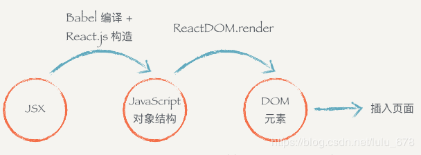
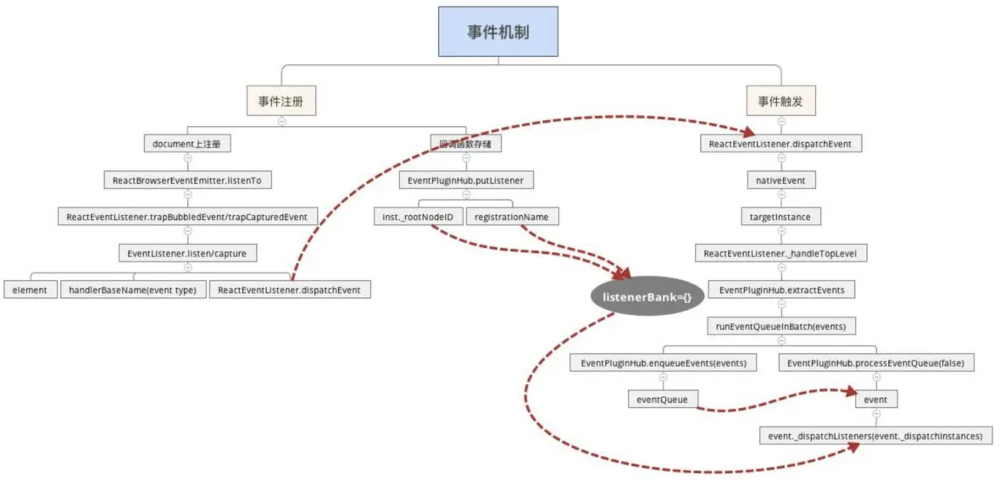
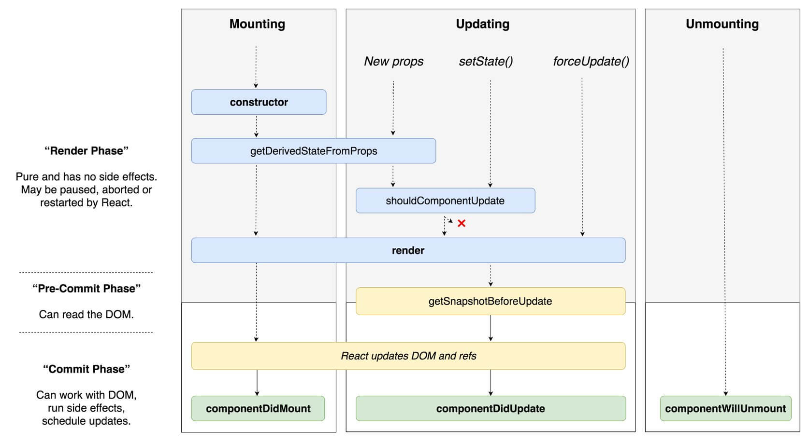
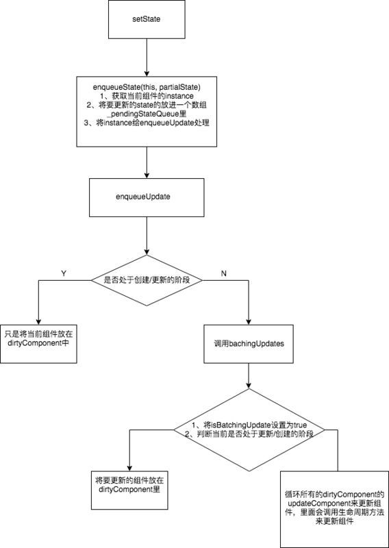
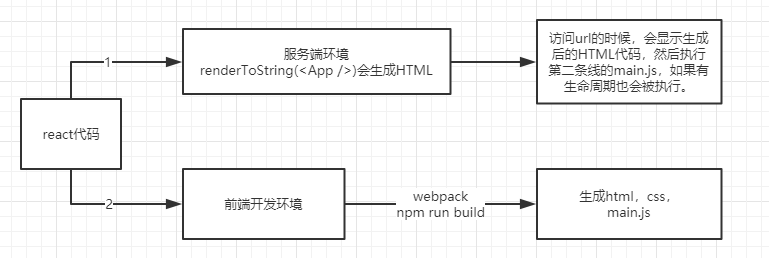
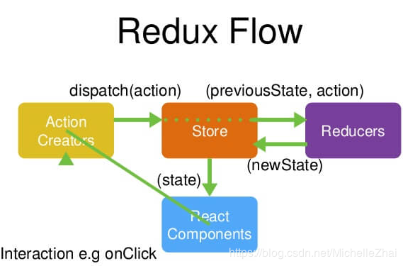
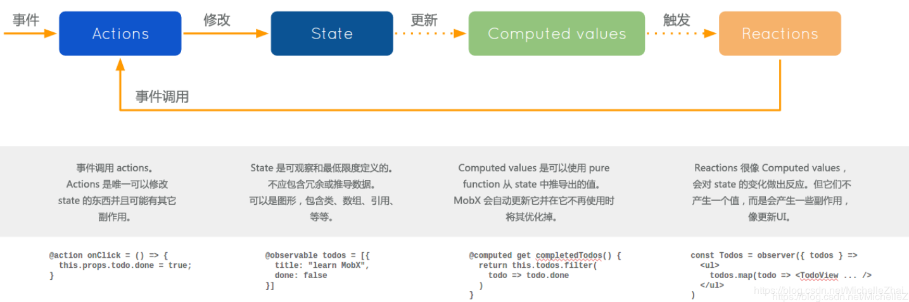

Vue
====
### vue原理  
1. **原理**：它是一个精简的MVVM框架，通过双向数据绑定链接View和Model层，视图层的变动自动反应在Model上，反之亦然。而实现此方式，需要三个模块的支持：  
    * **Observer**
        - 能够对数据对象进行监听，如有变动，拿到最新值通知订阅者
    * **Compile**
        - 对每个元素节点的指令进行扫描和解析，根据指令模版替换数据，以及绑定相应的更新函数
    * **Watcher**
        - 作为链接二者的桥梁，能够订阅并收到每个属性变动的通知，执行指令绑定相应的回调函数，从而更新视图

> vue数据双向绑定的原理(_也即是Observer_)：采用数据劫持和发布/订阅者模式的方式，通过```Object.defineProperty()```来劫持各个属性的```setter```，```getter```，在数据变动时发布消息给订阅者，触发相应的监听回调用；   

### 实现一个数据的双向绑定
```javascript
let obj = {};
let input = document.getElementById('input');
let span = document.getElementById('span');
// 数据劫持
Object.defineProperty(obj, text, {
    configurabel: true,
    enumerable: true,
    get() {
        console.log('数据获取')
    },
    set(val) {
        input.value = val
        span.inderHTML = val
    }
})
// 输入监听
input.addEventListener('keyup', function(e) {
  obj.text = e.target.value
})
```

### defineProperty和proxy的区别  
1. 后者的优势更大，效率及性能更高，具体体现在如下代码中，Vue3.0将会采用次属性  
```javascript
let obj = {
    age: 11
}
let val = 1
Object.defineProperty(obj, 'name', {
    get() {
        return val
    },
    set(newVal) {
        val = newVal
    }
})
// obj.name 等于1
// obj.name = 2;  val = 2


// proxy可以遍历每一个属性，而defineProperty只能对其中一个属性就行操作
let agent = new Proxy(star, {
    get: function (target, key) {
        if (key === 'phone') {
            //返回经纪人自己的手机号
            return '13838383838'
        }
        if (key === "price") {
            //明星不报价，经纪人报价
            return 120000
        }
        return target[key]
    },
    set: function (target, key, val) {
        if (key === 'customPrice') {
            if (val < 100000) {
                throw new Error("价格太低")
            } else {
                target[key] = val
                return true
            }
        }
    }
})
// console.log(agent.name) //zhang
// console.log(agent.phone) // 13838383838
// console.log(agent.age) // 25
// console.log(agent.price) // 120000
// proxy返回的是一个新的对象，可以通过操作返回的新的对象达到目的

```
- 当使用 defineProperty 时，我们修改原来的 obj 对象就可以触发拦截
- 而使用 proxy，就必须修改代理对象，即 Proxy 的实例才可以触发拦截
- 设计模式而言，proxy属于**代理模式**

### vue生命周期
1. 如图 
2. watch 和computed
    - watch用在数据变化时执行异步或开销较大的操作
    - computed用于属性依赖的计算
> computed在计算属性的时候可以提供一个方法或者是属性的getter和setter
```js
data: {
    setValue: 'name'
},
computed: {
    evenNumbers: function () {
        return this.numbers.filter(function (number) {
            return number % 2 === 0
        })
    },
    fullname: {
        get: function() { // getter
            return this.setValue
        },
        set: function(val) { // setter
            this.setValue = this.setValue + val
        }
    }
}
```
### 小注意事项
    - 切换表单组件的时候，无状态的input框会保留value值，通过写入key属性完成
    - 更改属性可以动态响应到dom上，可以用var app = new Vue();app.set(obj, 属性名, value)
    ```js
    vm.$set(vm.userProfile, 'age', 27)
    ```
    - $emit触发当前实例上的事件(自定义事件)```this.$emit('delete', this.id)```,就可以子组件调用定义在父组件上定义的方法了
    - $nextTick使用，有些类似，setState中的第二个参数回调函数的作用
    ```javascript
    export default {
        data() {
            return {
            message: "没有更新"
            };
        },
        methods: {
            update() {
            this.message = "123";
            console.log(this.$refs.div.textContent, '@@@'); // 未更新
            this.$nextTick(function() {
                console.log(this.$refs.div.textContent, '***'); // 123
            });
            }
        }
    };
    ```
    - computed对应的属性为一个方法，不然访问不到当前实例
    
### vue.extend 和mixins（混入，可以混入多个）/extends（继承组件，只能有一个）区别
1. mixin是混入，一旦混入它将影响每一个之后创建的vue实例， 参数是一个对象，例如：
```js
Vue.mixin({
    created: function () {
        var myOption = this.$options.myOption
        if (myOption) {
        console.log(myOption)
        }
    }
})

new Vue({
    myOption: 'hello!'
})
// => "hello!"
// 实质上 是对实例的方法进行扩展
// 场景：需要注入全局的method、filters、hook
```
2. extend,使用vue基础构造器，创建一个子类，参数是包含一个组件的对象
```js
<div id="mount-point"></div>
// 创建构造器
var Profile = Vue.extend({
 template: '<p>{{firstName}} {{lastName}} aka {{alias}}</p>',
 data: function () {
  return {
   firstName: 'Walter',
   lastName: 'White',
   alias: 'Heisenberg'
  }
 }
})
// 创建 Profile 实例，并挂载到一个元素上。
new Profile().$mount('#mount-point') // div会被渲染称为p

// 场景：当我们不需要全局去混入一些配置，比如，我们想要获得一个component
```
3. 区别：
    - mixin是对Vue类的options进行混入。所有Vue的实例对象都会具备混入进来的配置行为
    - extend是产生一个继承自Vue类的子类，只会影响这个子类的实例对象，不会对Vue类本身以及Vue类的实例对象产生影响

### vuex
1. 它是一个状态几种管理器，并以相应的规则保证状态以一种可预测的方式发生变化，主要包括state(驱动应用的数据源),action(响应view上的用户输入导致的状态变化),view（以声明的方式将state映射到视图）
2. getters相当于vue中的computed计算属性, 获取方法如下
```js
import { mapGetters, mapState } from 'vuex'
computed: { // state 用于存储数据，调用方法如下
    ...mapGetters(['level']),
    ...mapState(['userInfo', 'classes']),
},

//触发action
import store from '../store'
store.dispatch('login', { // action定义的名称
    name: this.name,
    password: this.password,
}).then( () => {
    this.loading =false;
    this.$router.push('/home')
})
// 调用mutation
store.commit('increment', v) // 定义的mutation的名称 v传参数
// 在actions中调用如下
login({commit}, e){
    commit('changeUser', e) // 调用mutations
    return new Promise( (resolve) => {
        setTimeout(function() {
            resolve({code: 200, msg: '登录成功'})
        },400)
    })
}
```
2. 


### vue-router
1. 注意点
```js
{
    path: '/home',
    name: 'home', 
    component: () => import('./pages/home.vue'),
    children: [
        {
            path: 'cell',
            component: () => import('./pages/cell.vue')
        },
    ]
}
// 嵌套路由时，如果children里面的path不要加 ‘/’ 不然会以根路由对待，不加‘/’这个的话 那么上述home/cell 就可以正确匹配了，稍微有点区别与react路由

// name是可以用在方法或者router-link标签使用， 例如
router.push({name: 'home', params: {userId: 123}})
<router-link :to="{ name: 'user', params: { userId: 123 }}">User</router-link>

// 获取路由的参数this.$route.params
// 路由跳转 this.$router.push

// 路由的钩子函数
router.beforeEach((to, from, next) => {
// 要确保调用next()
})
router.afterEach((route) => {

})
```


### 服务端渲染及框架nuxt.js
1. vue服务端渲染
```js
// 借助插件来完成的vue-server-renderer
// 第 1 步：创建一个 Vue 实例
const Vue = require('vue')
const app = new Vue({
  template: `<div>Hello World</div>`
})

// 第 2 步：创建一个 renderer
const renderer = require('vue-server-renderer').createRenderer()

// 第 3 步：将 Vue 实例渲染为 HTML
renderer.renderToString(app, (err, html) => {
  if (err) throw err
  console.log(html)
  // => <div data-server-rendered="true">Hello World</div>
})

// 在 2.5.0+，如果没有传入回调函数，则会返回 Promise：
renderer.renderToString(app).then(html => {
  console.log(html)
}).catch(err => {
  console.error(err)
})


```
2. nuxt.js


### vue项目优化
1. 循环加key
2. v-if(不需要频繁切换的) v-show
3. computed 和watch区分场景使用
4. 绑定时间进行销毁
5. 图片懒加载，路由懒加载
6. 按需要引入 babel-plugin-component 
7. v-once只渲染一次，后面的渲染及更新可以跳过这个dom，达到优化


### vue和react虚拟dom有什么区别吗？diff区别
1. 虚拟dom都是一样的，一种真实dom的js对象化，两者对于dom的更新策略不太一样， react采用自顶向下的全量diff，vue是局部订阅的模式
2. react 函数式组件思想 当你 setstate 就会遍历 diff 当前组件所有的子节点子组件, 这种方式开销是很大的, 所以 react 16 采用了 fiber 链表代替之前的树，可以中断的，分片的在浏览器空闲时候执行，vue 组件响应式思想 采用代理监听数据，我在某个组件里修改数据，就会明确知道那个组件产生了变化，只用 diff 这个组件就可以了


React
====
### React原理
react采用单项数据流动， 作为一个mvc中的V（视图层），内部通过虚拟Dom进行diff运算，在更新需要更新的视图，相比较传统前端操作dom性能和体验要好很多。

### 受控组件与非受控组件
1. 受控组件：每当表单的状态发生变化，都会被写入到组件的state中，这种组件就被称为受控组件。
> 默认值存储在state中，每当表单值发生变化，调用onChange事件处理，使用setState触发渲染
2. 非受控组件：一个表单组件没有value props就可以称为非受控组件，通常需要添加ref prop来访问渲染后的底层DOM元素
3. 区别：非受控组件状态并不会受到应用状态的控制，应用中也多了局部的组件状态，而受控组件的值来源与state

### 虚拟DOM，为什么能提高性能  
- 虚拟dom是react使用js实现了一套dom结构
- 首先操作真是DOM的耗费的性能代价太大，而js操作对象会很快，而虚拟dom是js和真实dom中间加了一个缓存，通过diff算法，找出变化的dom节点，然后在更新真实的dom，从而提高性能  
- diff算法经过两个阶段：
    + diff: 计算虚拟DOM树转换为真实DOM树
    + patch: 将差异更新到真实的DOM节点

### react的diff算法
1. 就是对比两个virtural Dom（fiber子节点树），首先进行的是统一比较，不同类的直接替换，根据keys判断列表dom是删除还是添加，从而减少对比的复杂度。
2. 策略：减少了diff算法的复杂度
    - tree diff
    > webui中dom节点的跨层级移动操作少的可以忽略不计，react只会比较同级别的dom，当出现跨层级也不会进行跨层级比较，依然比较同级的dom，没有则删除，有则添加
    - component diff
    > 1)如果是同一类型组件，按照原策略进行虚拟dom比较；2）不同类组件则直接进行替换；3）如果是同一个类型的组件，有可能经过一轮virtural dom比较后，并没有改变，如果我们可以提前知道这一点就可以省去不必要的diff时间，因此，react允许用户通过shouldComponentUpdate生命周期来判断是否需要进行diff分析；
    - element diff  
    > 当节点属于同一层级时，diff提供三种操作，分别是插入、移动、删除（即keys的重要性）


### JSX是如何解析的
1. JSX是react的语法糖，它将Dom看成是一个对象（标签名，属性，子元素）。通过ReactDom.render将dom树插入到页面的某个特定元素上（#root）  
  
> jsx是javascript语言的一种语法扩展  
> jsx是描述你的组件长什么样子，在编译时会编程相应的js对象描述  
> react-dom负责把这个用来描述UI 信息的 JavaScript 对象变成 DOM 元素，并且渲染到页面上  


### react中keys和refs的作用
1. **keys**  
    - keys是react用于追踪哪些列表中的元素被修改、被添加、或者被移除的辅助标识。在diff算法中会借助此元素来判断该元素是新创建的还是被移动而来的元素，从而减少不必要元素被渲染
2. **refs**  
    - refs是react提供给我们安全访问DOM元素的, 使用方法如下：
    ```javascript
    1）回调函数 
        ref={ node => this.node = node}
    2）React.createRef()
        通过.current找到真是的dom
    ```

### react的事件机制
> react自己实现了一套事件机制，将浏览器的原生事件封装为合成事件```SyntheticEvent```，与原生事件相同的接口，不过他们屏蔽了底层浏览器的细节差异，抹平了浏览器之间的兼容问题。这些事情其实并没有附着到元素上，而是通过事件代理的方式，将所有事件统一绑定到了顶层（document），这样在更新dom的时候就不用考虑如何去处理附着在dom上的事件监听了，减少了内存的消耗，最终达到优化的目的。  
> 另外冒泡到document上的事件也不是原生浏览器事件，而是react的合成事件，因此要阻止冒泡的话需要采用```event.preventDefault```

### react事件注册和分发 !!!
> 根据react事件机制，事件并没有绑定在元素上，而是通过事件代理的方式，绑定到了document上，这样再次更新的时候相应的事件将不在注册
> 事件分发主要是通过dispatchEvent进行，从事件触发组件开始，向父元素遍历  
  


### react的Fiber概念
> 起因：16以前对virtural dom的更新是同步的，如果层级比较深，相应占用主线程的时间就长，一些用户操作就得不到回应，导致页面动画卡顿、丢帧，导致用户体验差，16以后引入fiber来解决这个问题，fiber把一个任务分成多个小片，当分给小片的时间用尽后，就检查任务列表中优先级更高的任务去执行，也就是异步渲染。  

> Fiber就是通过对象记录组件上的需要做和已经完成的更新，一个组件可以对应多个fiber，在render函数中创建的React Element树在第一次渲染的时候会创建一颗结构一模一样的Fiber节点树。不同的React Element类型对应不同的Fiber节点类型。一个React Element的工作就由它对应的Fiber节点来负责  

> 一个React Element可以对应不止一个Fiber，因为Fiber在update的时候，会从原来的Fiber（我们称为current）clone出一个新的Fiber（我们称为alternate）。两个Fiber diff出的变化（side effect）记录在alternate上。所以一个组件在更新时最多会有两个Fiber与其对应，在更新结束后alternate会取代之前的current的成为新的current节点。  

> Fiber的出现主要是针对react更新渲染的第一阶段，更新阶段包括：  
    * ```reconcilier:``` 虚拟dom进行diff算法的对比，一旦进行就无法中断，如果有大量的计算就会一直占用主线程，导致交互和动画的卡顿现象  
    * ```commit:``` 把diff算法的结果element放到任务队列里，然后更新dom  
```javascript
1) Reconcilier阶段包括：  
componentWillMount
componentWillReceiveProps
shouldComponentUpdate
componentWillUpdate

> 为什么会多次执行这个will的生命周期呢？在异步渲染的时候，会调用requestIdelCallback API，在回掉函数中可以获得当前的callback参数（分片任务）还能执行多久，如果时间不够，分片任务会打断，下次就只能空闲时重新执行

2) Commit
componentDidMount
componentDidUpdate
componentWillUnmount

// 因为reconcilier阶段是可以被打断的（Fiber调和运算的作用），所以这里的生命周期可能会执行多次，从而引起bug，因此新的版本除了shouldComponentUpdate外，其他的周期都应该避免使用，也因此引进了新的API  
// getDerivedStateFromProps 代替了 componentWillReceiveProps, 会在初始化和update时调用  
// getSnapshotBeforeUpdate 代替了 componentWillUpdate, 会在update后，dom更新前调用
```


### react通信方式有哪些  
- 父子通信
    + 父传子用props，子传父调用父给子的方法  
- 兄弟组件通信
    + 公用父组件，数据取自父级的state作为兄弟的props用
- 跨多层级组件通信  
    + 可以使用context使用  
    ```javascript
    const ctx = React.createContext()
    class Parent extends React.Component {
        render () {
            return (
                // value 就是传入 Context 中的值
                <ctx.Provider value='yck'>
                    <Child />
                </ctx.Provider>
            )
        }
    }
    class Child extends React.Component {
        render () {
            return (
                <ctx.Consumer>
                    // 取出值
                    {context => (
                        name is { context }
                    )}
                </ctx.Consumer>
            );
        }
    }
    // 或者使用useContext
    function Box() {
        const value = useContext(ctx); // 只能用在函数组件中
        return(
            <div>
                {value} ---
            </div>
        )
    }
    ```
### HOC是什么及render props以及hook  
1. HOC俗称高阶组件：就是一个函数，接收一个组件作为参数，并返回一个新的组件
    - 作用就是提高组件的复用性，将不同组件需要公用的方法抽取出来，达到共享的效果，例如操作props, state, 通过refs访问组件实例,用其他元素包裹；  
    - HOC类似函数式编程的思想，对于被包裹组件是不会感知到高阶组件的存在，而高阶组件返回的组件会在原来的组件之上具有功能增加的效果，与vue的Mixin这种混合模式，会给组件增加新的方法和属性，组件本身不仅可以感知，甚至需要做相关的处理（命名冲突，状态维护），一旦混入的模块变多，整个组件就变的难以维护，也就是为什么如此多的react库都采用高阶组件的方式进行开发；
    - 常见的HOC有redux中的connect()(wrapperComponent), antd中Form.create()等  


2. render props指的是让 React 组件的 props 支持函数这种模式。因为作为 props 传入的函数往往被用来渲染一部分界面。其实就是以props.后缀开头来执行的逻辑渲染关系，就可以称之为render props
```javascript
const Auth = (props) => {
  const userName = getUserName();

  if (userName) {
    const allProps = {userName, ...props};
    return (
      <React.Fragment>
        {props.login(allProps)}
      </React.Fragment>
    );
  } else {
    <React.Fragment>
      {props.nologin(props)}
    </React.Fragment>
  }
};

// 调用处
<Auth
    login={({userName}) => <h1>Hello {userName}</h1>}
    nologin={() => <h1>Please login</h1>}
/>
// 所以高阶组件和render props都是重用组件逻辑的
// 场景：平级组件单向依赖就可以使用这个技术，例如A组件内部的渲染需要B组件内部的状态，如果相互依赖，直接抽到父级组件去做了
```

### React的生命周期mount(挂载)和update(更新)描述下




### react中的isBatchingUpdates、Transaction
这两个概念主要是处在setState中，也是react更新DOM最重要的一环，setState最终是通过enqueueUpdate执行state更新的，  
- isBatchingUpdates：表示react是否处在一个批量更新的状态，其值是一个布尔值。
- Transaction：事务，类似react终的一个中间件，保证数据的一致性。  
setState的更新流程如下图：
  
1. partialState可以是object || function，它会产生新的state以一种Object.assign（）的方式跟旧state进行合并
2. enqueueState做了两件事：将新的state放进数组里，用enqueueUpdate来处理将要更新的实例（_instance)
3. 是否处于批量创建/更新组件的过程（```batchingStrategy.isBatchingUpdates```）,如果=false,则处理调用```batchingStrategy.batchedUpdates```去执行 update state事务，如果=true,则将当前的组件放在dirtyComponents数组中，所以不是每一次的setState都会更新组件。
4. 如果当前事务正在更新过程中，则使用enqueueUpdate将当前组件放在dirtyComponents里，如果当前不在更新过程的话，则执行更新事务。
5. transaction对象暴露了一个perform的方法，用来执行anyMethod，在anyMethod执行的前，需要先执行所有wrapper的initialize方法，在执行完后，要执行所有wrapper的close方法。


### react中setState更新机制，什么时候同步还是异步
1. 在react中，如果是由react引发的事件处理（比如onclick）调用setState不会同步更新this.state，除此之外调用setState会同步this.state，所谓了“除此之外”，指的是绕过react，通过addEventListener直接添加的事件处理函数，还有通过setTimeout/setInterval产生的异步调用。
> **原因：**在React的setState函数实现中，会根据一个变量isBatchingUpdates判断是直接更新this.state还是放到队列中回头再说，而isBatchingUpdates默认是false，也就表示setState会同步更新this.state，但是，有一个函数batchedUpdates，这个函数会把isBatchingUpdates修改为true，而当React在调用事件处理函数之前就会调用这个batchedUpdates，造成的后果，就是由React控制的事件处理过程setState不会同步更新this.state。
2. 看一个示例明白一下：
```javascript
class Seet extends Component {
  constructor() {
    super();
    this.state = {
      val: 0
    };
  }
  componentDidMount() {
    this.setState({val: this.state.val + 1});
    console.log(this.state.val);    // 第 1 次 log

    this.setState({val: this.state.val + 1});
    console.log(this.state.val);    // 第 2 次 log

    // setTimeout(() => {
    //   this.setState({val: this.state.val + 1});
    //   console.log(this.state.val);  // 第 3 次 log

    //   this.setState({val: this.state.val + 1});
    //   console.log(this.state.val);  // 第 4 次 log
    // }, 0);
  }
  
  handle = () => {
    console.log(this.state.val)
  }
  render() {
    return (
      <div>
        <button onClick={this.handle}>按钮</button>
      </div>
    )
  }
}
// 1. 第一次和第二次都是在 react 自身生命周期内，触发时 isBatchingUpdates 为 true，所以并不会直接执行更新 state，而是加入了 dirtyComponents，所以打印时获取的都是更新前的状态 0，也就是第一次，第二次为0。当在点击按钮时显示的是1，因为此时已经异步更新完毕了

// 2. 放开setTimeout这段代码时，由于不在react自身的事件处理中，所以isBatchingUpdates为false，可以同步更新this.state，所以第三次log为2，第四次的为3
```

### react事件中为什么要绑定this
1. 在jsx语法中onClick只是一个中间变量，因为react有自己的一套事件机制，将函数赋值给onClick这个中间变量，在解析和语法转换时里面的this就丢失了，不在指向实例对象，所以写事件的时候需要onClick={this.handle.bind(this)},但是🈶️出于性能影响，在constructor里面去绑定this,后面就出现了箭头函数


### ssr(sever slide rendering)  
1. 即服务端渲染，可以优化首屏的加载速度，优化搜索引擎爬虫爬取页面  
2. 借助react的属性renderToString || renderToStaticMarkup这个API来实现，流程如下图  
  
> 区别在于前者渲染的时候带有data-reactId，而后者没有


### 性能的优化
- shouldComponentUpdate, 针对这个周期进行重写，返回布尔值从而进行是否继续更新  
- 针对复杂数据的结构，可以在上述周期中使用immutable库来产生不可变对象，一旦数据变动就会生成新的对象，这样前后对比就会很方便，从而提高性能  
- 如果只是浅比较，可以使用pureComponent，或者hook函数中的react.mome()  
- 使用production版本的react.js  
- 使用key来帮助react识别列表中自组件的最小变化，不建议使用index，因为每次index会变


### redux和mobx
> 区别：mobx入手简单于redux，大型项目优选redux，简单考虑mobx（鉴于代码量的关系），其次是redux更多的是遵循函数式编程（如reducer），mobx更多是基于面向对象 

1. redux：如上图，用户发出action，stroe接收后并自动调用reducer，并返回新的state，state一旦发生变化就会触发监听函数，然后重新渲染view  
    - 特点：唯一的数据源、保持只读状态，数据改变只能通过纯函数来执行
2. redux-thunk和redux-saga：用来解决异步action的
    - 中间件的概念就是在dispatch一个action 后，到达reducer之前，进行一些额外的操作
    ```javascript
        // 引入中间件后就可以在action 中创建异步了，例如：
        import { applyMiddleware, createStore } from 'redux';
        import thunk from 'redux-thunk';
        const store = createStore(
            reducers,
            applyMiddleware(thunk)
        );

        export const getTodoList = () => {
            return () => {
                axios.get('./list').then((res)=>{
                    const data = res.data;
                    const action  = initListAction(data);
                    StorageEvent.dispatch(action);
                })
            }
        }
    ```
    - 而redux-saga是将所有的异步操作逻辑收集在一个地方进行几种处理，这也是区别redux-thunk（分散的一个action对应一个异步操作，异步操作action返回的是一个函数，而不是同步时的对象）
    ```javascript
        import { createStore, applyMiddleware } from 'redux'
        import createSagaMiddleware from 'redux-saga'
        import reducer from './reducers'
        import mySaga from './sagas'

        const sagaMiddleware = createSagaMiddleware()
        const store = createStore(
            reducer,
            applyMiddleware(sagaMiddleware)
        )

        // then run the saga
        sagaMiddleware.run(mySaga)；
        export default store;
        
        // sagas.js
        import { call, put, takeEvery, takeLatest } from 'redux-saga/effects'
        import Api from '...'

        // worker Saga: will be fired on USER_FETCH_REQUESTED actions
        function* fetchUser(action) {
            try {
                const user = yield call(Api.fetchUser, action.payload.userId);
                yield put({type: "USER_FETCH_SUCCEEDED", user: user});
            } catch (e) {
                yield put({type: "USER_FETCH_FAILED", message: e.message});
            }
            }
        function* mySaga() {
            yield takeEvery("USER_FETCH_REQUESTED", fetchUser);
        }

        export default mySaga;
    ```



2. mobx：如上图


#### react-router底层原理 
本质就是监听 URL 的变化，然后匹配路由规则，显示相应的页面，并且无须刷新，分类两种方式hash和history模式；


### 服务端渲染框架next.js

小程序
====
### 小程序原理